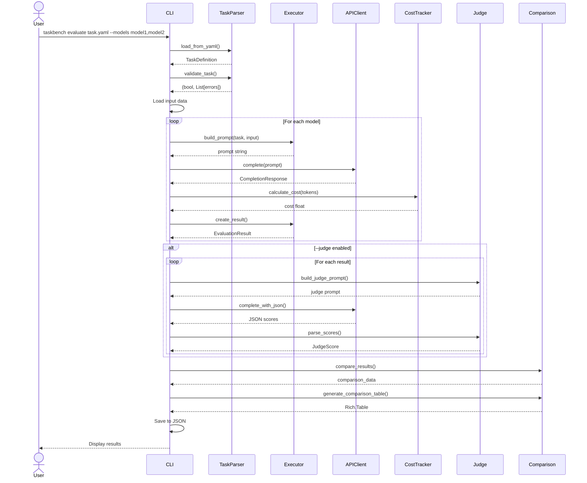
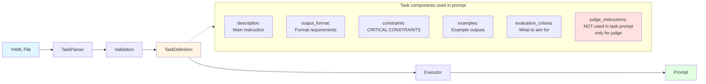
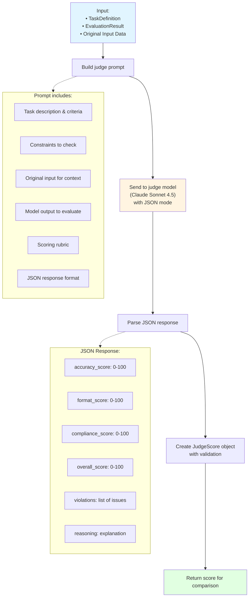

# LLM TaskBench Architecture

## Table of Contents

- [High-Level Overview](#high-level-overview)
- [System Architecture](#system-architecture)
- [Component Descriptions](#component-descriptions)
- [Data Flow](#data-flow)
- [Design Decisions](#design-decisions)
- [Technology Stack](#technology-stack)

## High-Level Overview

LLM TaskBench is a task-specific LLM evaluation framework that enables developers and researchers to objectively compare language models on custom, domain-specific tasks. The framework combines agentic orchestration with LLM-as-judge evaluation to provide accurate, reproducible performance metrics.

### Recent Enhancements
- Use-case layer: declarative use-case specs (goal, constraints, notes) that drive prompt/rubric generation for both executor and judge.
- Model recommendations: orchestrator suggests models from OpenRouter based on use-case traits (e.g., long-context, cost priority) with env-driven defaults (e.g., `GENERAL_TASK_LLM`).
- UI: FastAPI + Streamlit for selecting use-cases, inputs, recommended models, running evaluations, judging, and viewing recommendations.
- Cost visibility: inline + generation lookup billing, per-run and per-use-case rollups displayed in CLI and UI.
- Parallel execution by default with retry/backoff and rate limiting hooks.

### Key Features

- **Task-Specific Evaluation**: Define custom tasks with YAML configuration
- **Multi-Model Support**: Evaluate multiple LLMs simultaneously via OpenRouter API
- **LLM-as-Judge**: Automated evaluation using Claude Sonnet 4.5
- **Cost Tracking**: Real-time cost calculation and tracking
- **Rich CLI**: User-friendly command-line interface with progress indicators
- **Extensible Design**: Easy to add new models, tasks, and evaluation criteria

### Design Philosophy

1. **Declarative Task Definition**: Tasks are defined in YAML, separating configuration from code
2. **Type Safety**: Pydantic models ensure data validation throughout the pipeline
3. **Async-First**: Asynchronous I/O for efficient API interactions
4. **Separation of Concerns**: Clear boundaries between API client, executor, judge, and cost tracking
5. **Observable**: Rich console output and detailed logging for transparency

## System Architecture

```mermaid
flowchart TD
    CLI["CLI Interface<br/>(taskbench/cli/main.py)<br/><br/>Commands: evaluate, models, validate"]
    
    subgraph Orchestration["Orchestration Layer (taskbench/evaluation/*)"]
        Executor["Executor<br/>- Builds prompts<br/>- Runs tasks<br/>- Collects results"]
        Judge["Judge<br/>- Evaluates outputs<br/>- Scores models<br/>- Detects violations"]
        CostTracker["CostTracker<br/>- Calculates costs<br/>- Tracks usage<br/>- Provides stats"]
        Orchestrator["Model Recommender<br/>- Use-case aware<br/>- Cost/context filters"]
    end
    
    subgraph APIClient["API Client Layer (taskbench/api/*)"]
        OpenRouter["OpenRouterClient<br/>- HTTP requests<br/>- Authentication<br/>- Error handling<br/>- JSON mode"]
        Retry["Retry Logic<br/>- Exponential backoff<br/>- Rate limiting<br/>- Transient errors"]
    end
    
    subgraph CoreModels["Core Models (taskbench/core/*)"]
        TaskDef["TaskDefinition<br/>ModelConfig"]
        EvalResult["EvaluationResult<br/>CompletionResp."]
        JudgeScore["JudgeScore<br/>TaskParser"]
    end
    
    subgraph External["External Services"]
        OpenRouterAPI["OpenRouter API<br/>(aggregates multiple LLM providers)<br/><br/>• Anthropic (Claude)<br/>• OpenAI (GPT-4)<br/>• Google (Gemini)<br/>• Meta (Llama)<br/>• Alibaba (Qwen)<br/>• And more..."]
    end
    
    CLI --> Orchestration
    Orchestration --> APIClient
    CLI --> UI["FastAPI/Streamlit UI<br/>Runs & Use-cases"]
    UI --> Orchestration
    APIClient --> CoreModels
    CoreModels --> External
    
    style CLI fill:#e1f5ff
    style Orchestration fill:#fff4e1
    style APIClient fill:#f0e1ff
    style CoreModels fill:#e1ffe1
    style External fill:#ffe1e1
```



## Component Descriptions

### 1. CLI Interface (`taskbench/cli/main.py`)

**Purpose**: Provides user-facing command-line interface.

**Responsibilities**:

- Parse command-line arguments using Typer
- Load environment variables and configuration
- Coordinate between evaluation components
- Display results with Rich formatting
- Handle errors and provide user feedback

**Key Commands**:

- `evaluate`: Run multi-model evaluation on a task
- `models`: List available models and pricing
- `validate`: Validate task definition YAML files

**Design Pattern**: Command pattern with async/await for I/O operations.

### 2. Core Models (`taskbench/core/models.py`)

**Purpose**: Define type-safe data structures using Pydantic.

**Key Models**:

- **TaskDefinition**: Represents a user-defined evaluation task
  - Name, description, input/output types
  - Evaluation criteria and constraints
  - Examples and judge instructions
  - Validation rules for input/output formats

- **CompletionResponse**: API response from LLM completion
  - Response content and metadata
  - Token usage (input, output, total)
  - Latency metrics

- **EvaluationResult**: Single model evaluation result
  - Model output and status
  - Token usage and cost
  - Timestamp and error information

- **JudgeScore**: LLM-as-judge scoring result
  - Multi-dimensional scores (accuracy, format, compliance)
  - Violations list
  - Detailed reasoning

- **ModelConfig**: Model pricing and configuration
  - Pricing per million tokens
  - Context window size
  - Provider information

**Design Pattern**: Data Transfer Objects (DTOs) with built-in validation.

### 3. Task Parser (`taskbench/core/task.py`)

**Purpose**: Load, validate, and save task definitions from YAML.

**Responsibilities**:

- Parse YAML files into TaskDefinition objects
- Validate task structure and constraints
- Check for logical errors (e.g., min >= max)
- Save tasks back to YAML format

**Validation Rules**:

- Required fields must be present
- Input/output types must be valid
- Constraints must be logically consistent
- Min/max pairs must satisfy min < max

### 4. API Client (`taskbench/api/client.py`)

**Purpose**: Interface with OpenRouter API for LLM completions.

**Responsibilities**:

- Manage HTTP connections with httpx
- Handle authentication and headers
- Parse API responses
- Calculate latency metrics
- Support both standard and JSON mode completions

**Error Handling**:

- `AuthenticationError`: Invalid API key (401)
- `RateLimitError`: Rate limit exceeded (429)
- `BadRequestError`: Malformed request (400)
- `OpenRouterError`: Server errors (5xx)

**Design Pattern**: Async context manager for resource management.

### 5. Retry Logic (`taskbench/api/retry.py`)

**Purpose**: Handle transient errors and rate limiting.

**Components**:

- **RateLimiter**: Token bucket rate limiting
  - Tracks requests per minute
  - Sleeps when limit would be exceeded
  - Thread-safe with async locks

- **retry_with_backoff**: Decorator for exponential backoff
  - Retries transient errors (rate limits, timeouts, 5xx)
  - Skips non-retryable errors (auth, bad requests)
  - Exponential backoff with jitter

**Design Pattern**: Decorator pattern for cross-cutting concerns.

### 6. Model Executor (`taskbench/evaluation/executor.py`)

**Purpose**: Execute tasks on LLM models and collect results.

**Responsibilities**:

- Build comprehensive prompts from task definitions
- Make API calls with configured parameters
- Calculate costs using CostTracker
- Handle execution errors gracefully
- Display progress with Rich progress bars

**Prompt Building Strategy**:

1. Task description and context
2. Output format requirements (emphasized)
3. **CRITICAL CONSTRAINTS** section (bold)
4. Examples of good outputs
5. Evaluation criteria
6. Input data
7. Final instructions

**Design Pattern**: Template method for prompt building.

### 7. LLM Judge (`taskbench/evaluation/judge.py`)

**Purpose**: Evaluate model outputs using LLM-as-judge pattern.

**Responsibilities**:

- Build evaluation prompts for judge model
- Request JSON-formatted scores
- Parse and validate judge responses
- Categorize violations by type
- Generate comparison reports

**Evaluation Dimensions**:

- **Accuracy Score** (0-100): Content correctness
- **Format Score** (0-100): Format compliance
- **Compliance Score** (0-100): Constraint adherence
- **Overall Score** (0-100): Weighted combination

**Violation Categories**:

- `under_min`: Below minimum requirements
- `over_max`: Exceeds maximum limits
- `format`: Format specification violations
- `missing_field`: Required fields absent
- `other`: Miscellaneous issues

### 8. Model Comparison (`taskbench/evaluation/judge.py`)

**Purpose**: Compare and rank evaluation results.

**Responsibilities**:

- Combine evaluation results with judge scores
- Sort models by overall score
- Calculate value metrics (score/cost ratio)
- Generate comparison tables
- Identify best overall and best value models

**Design Pattern**: Strategy pattern for different comparison metrics.

### 9. Cost Tracker (`taskbench/evaluation/cost.py`)

**Purpose**: Calculate and track evaluation costs.

**Responsibilities**:

- Load model pricing from YAML configuration
- Calculate costs from token usage
- Track cumulative costs across evaluations
- Provide cost breakdowns by model
- Generate cost statistics

**Pricing Model**:

- Input tokens: Price per 1M tokens
- Output tokens: Price per 1M tokens (usually higher)
- Total cost = (input_tokens/1M × input_price) + (output_tokens/1M × output_price)

**Design Pattern**: Repository pattern for pricing data.

## Data Flow

### Evaluation Flow



### Task Definition Flow



### Judge Evaluation Flow



## Design Decisions

### 1. Why OpenRouter?

**Decision**: Use OpenRouter as the unified API gateway.

**Rationale**:

- Single API for multiple providers (Anthropic, OpenAI, Google, Meta, etc.)
- Consistent interface across different models
- Built-in rate limiting and load balancing
- Cost-effective pricing
- No need to manage multiple API keys

**Trade-offs**:

- Dependency on third-party service
- Slight latency overhead vs. direct APIs
- Limited to models available on OpenRouter

### 2. Why LLM-as-Judge?

**Decision**: Use Claude Sonnet 4.5 as the evaluation judge.

**Rationale**:

- Scales to custom tasks without manual evaluation
- Provides detailed, explainable scores
- Detects subtle violations humans might miss
- Consistent evaluation criteria across runs
- Faster and cheaper than human evaluation

**Trade-offs**:

- Judge model adds cost (mitigated by using temperature=0.3)
- Judge can have biases or errors
- Requires careful prompt engineering for judge instructions

**Validation**: Research shows LLM-as-judge correlates well with human judgments for many tasks.

### 3. Why Pydantic Models?

**Decision**: Use Pydantic for all data structures.

**Rationale**:

- Runtime type checking and validation
- Automatic JSON serialization/deserialization
- Clear documentation through type hints
- IDE autocomplete and type checking
- Validation errors provide clear messages

**Benefits**:

- Catches errors early (at data ingestion)
- Self-documenting code
- Easy to extend with validators
- Seamless integration with FastAPI (future)

### 4. Why YAML for Task Definitions?

**Decision**: Use YAML instead of JSON or Python for task definitions.

**Rationale**:

- Human-readable and editable
- Supports multi-line strings (for judge instructions)
- Comments for documentation
- Less verbose than JSON
- Declarative (non-executable) for security

**Alternative Considered**: Python classes

- Rejected: Requires Python knowledge, harder to version control, potential security issues

### 5. Why Async/Await?

**Decision**: Use asyncio throughout the application.

**Rationale**:

- Non-blocking I/O for API calls
- Better performance for multi-model evaluation
- Scales well for concurrent requests
- Modern Python best practice for I/O-bound applications

**Complexity Trade-off**:

- Slightly more complex than synchronous code
- Worth it for performance gains (can evaluate 10 models in parallel)

### 6. Why Separate Executor and Judge?

**Decision**: Split evaluation into two phases: execution and judging.

**Rationale**:

- Single Responsibility Principle
- Can run without judge (--no-judge flag)
- Easy to swap judge models
- Clear separation of concerns
- Allows for alternative evaluation methods

### 7. Why Rich CLI?

**Decision**: Use Rich library for terminal output.

**Rationale**:

- Professional-looking output
- Progress bars for long operations
- Color-coded results (green=good, red=bad)
- Tables for easy comparison
- Better user experience

### 8. Why Track Costs?

**Decision**: Built-in cost tracking as a first-class feature.

**Rationale**:

- LLM API costs can add up quickly
- Users need visibility into spending
- Helps compare models on cost-effectiveness
- Enables budget constraints
- Promotes responsible API usage

## Technology Stack

### Core Dependencies

| Package | Version | Purpose |
|---------|---------|---------|
| **pydantic** | >=2.0.0 | Data validation and modeling |
| **pyyaml** | >=6.0 | YAML parsing for task definitions |
| **httpx** | >=0.25.0 | Async HTTP client for API calls |
| **typer** | >=0.9.0 | CLI framework |
| **rich** | >=13.0.0 | Terminal formatting and progress bars |
| **python-dotenv** | >=1.0.0 | Environment variable management |
| **fastapi** | >=0.110.0 | REST API for UI/backend |
| **uvicorn** | >=0.23.0 | ASGI server |
| **streamlit** | >=1.30.0 | Frontend UI |

### Development Dependencies

| Package | Purpose |
|---------|---------|
| **pytest** | Unit and integration testing |
| **pytest-asyncio** | Async test support |
| **pytest-cov** | Code coverage reporting |
| **pytest-mock** | Mocking for tests |
| **black** | Code formatting |
| **isort** | Import sorting |
| **mypy** | Static type checking |
| **flake8** | Linting |

### Python Version

- **Required**: Python 3.11+
- **Rationale**: Uses modern async features and type hints

### External Services

- **OpenRouter API**: LLM completions
- **Models Used**:
  - Task execution: User-specified (Claude, GPT-4, Gemini, Llama, Qwen, etc.)
  - Judge evaluation: Claude Sonnet 4.5 (default)

### File Formats

- **Task Definitions**: YAML
- **Model Pricing**: YAML
- **Results Output**: JSON
- **Input Data**: Plain text (user-provided)

### Architecture Patterns

1. **Async I/O**: Non-blocking API calls
2. **Dependency Injection**: Components receive dependencies
3. **Repository Pattern**: CostTracker for pricing data
4. **Strategy Pattern**: Different comparison metrics
5. **Template Method**: Prompt building
6. **Decorator Pattern**: Retry logic
7. **Data Transfer Objects**: Pydantic models
8. **Command Pattern**: CLI commands

### Error Handling Strategy

1. **API Errors**: Specific exception types (Auth, RateLimit, BadRequest)
2. **Retry Logic**: Exponential backoff for transient errors
3. **Validation Errors**: Pydantic validation with clear messages
4. **User Errors**: Friendly error messages in CLI
5. **Logging**: Structured logging for debugging

### Future Extensibility

The architecture supports future enhancements:

- **Custom Judge Models**: Easy to swap judge implementation
- **Additional Providers**: Can add direct API clients
- **Web Interface**: Pydantic models ready for FastAPI
- **Database Storage**: Can add persistence layer
- **Parallel Evaluation**: Already async-ready
- **Custom Metrics**: Extensible comparison logic
- **Streaming Results**: Can add WebSocket support

## Configuration

### Environment Variables

```bash
OPENROUTER_API_KEY=your-key-here  # Required
```

### Configuration Files

1. **config/models.yaml**: Model pricing database
2. **tasks/*.yaml**: Task definitions
3. **.env**: Environment variables (not committed)

### Project Structure

```
llm-taskbench/
├── src/taskbench/           # Main package
│   ├── core/                # Core models and task parser
│   ├── api/                 # API client and retry logic
│   ├── evaluation/          # Executor, judge, cost tracker
│   ├── cli/                 # Command-line interface
│   └── utils/               # Utilities (validation, logging)
├── tasks/                   # Task definitions
├── config/                  # Configuration files
├── tests/                   # Test suite
├── docs/                    # Documentation
├── examples/                # Example data and results
└── results/                 # Evaluation outputs
```

## Summary

LLM TaskBench is architected as a modular, extensible framework for task-specific LLM evaluation. The design prioritizes:

1. **Type Safety**: Pydantic models throughout
2. **Performance**: Async I/O for concurrent operations
3. **Usability**: Rich CLI with clear feedback
4. **Reliability**: Retry logic and error handling
5. **Transparency**: Cost tracking and detailed logging
6. **Extensibility**: Clean separation of concerns

The architecture supports the core workflow: define tasks declaratively, execute on multiple models efficiently, evaluate with LLM-as-judge objectively, and compare results comprehensively.
### 10. Model Recommender (`taskbench/evaluation/orchestrator.py`)

**Purpose**: Suggest appropriate models for a use-case.

**Responsibilities**:
- Read use-case/task traits (e.g., long-context, cost priority).
- Filter OpenRouter models (context window, pricing) and drop curated denylists.
- Provide a candidate set to CLI/UI; supports auto-selection when `--models auto`.

**Design Pattern**: Strategy/filtering heuristics with env-driven defaults.

### 11. Use-Case Layer (`usecases/*.yaml`)

**Purpose**: Capture intent/constraints beyond the task schema.

**Fields (example)**:
- name, goal, chunk_min/max, coverage_required, notes.
- default_judge_model (can reference env, e.g., `${GENERAL_TASK_LLM:-anthropic/claude-sonnet-4.5}`).
- default_candidate_models (seed list, not hard-wired).

**Usage**:
- Executor and Judge consume the use-case to build prompts/rubrics.
- Orchestrator uses it to recommend models.
