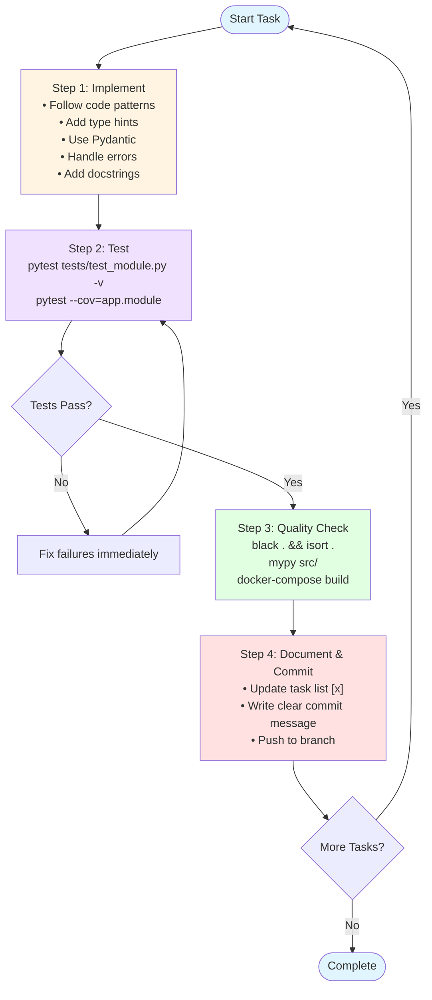

# LLM TaskBench - Implementation Handoff

**Version**: 0.1.0-alpha  
**Date**: 2025-11-18  
**Branch**: claude/implementation-<date>  

This document contains all the detailed guidance for implementing LLM TaskBench autonomously.

---

## Table of Contents

1. [Work Methodology](#work-methodology)
2. [Implementation Priorities](#implementation-priorities)
3. [Testing Requirements](#testing-requirements)
4. [Code Patterns](#code-patterns)
5. [Commit Strategy](#commit-strategy)
6. [Decision-Making Guidelines](#decision-making-guidelines)
7. [Blocker Handling](#blocker-handling)
8. [Completion Deliverables](#completion-deliverables)

---

## Work Methodology

### Phase 1: Foundation (Do First - 30 min)

**Read Context Files** (in order):

1. `CLAUDE.md` - Project overview, architecture, constraints, patterns
2. `ARCHITECTURE.md` - Detailed technical design (if exists)
3. `INTEGRATION-TASK-LIST.md` - Your task checklist

**Setup Environment**:

```bash
# Create branch
git checkout -b claude/implementation-$(date +%Y%m%d)

# Verify Docker
docker --version
docker-compose --version

# Install backend dependencies
cd backend
pip install -r requirements.txt -r requirements-dev.txt

# Install frontend dependencies
cd ../frontend
npm install
```

---

### Phase 2: Incremental Development

For **EACH** task in `INTEGRATION-TASK-LIST.md`:



#### Step 1: Implement (Write Code)

- Follow code patterns from CLAUDE.md
- Add type hints (mypy strict mode)
- Use Pydantic for all data validation
- Handle errors gracefully with try/except
- Add docstrings for public functions

#### Step 2: Test (Verify It Works)

```bash
# Unit tests
pytest tests/test_<module>.py -v

# Coverage check
pytest tests/test_<module>.py --cov=app.<module>

# Fix failures immediately - don't accumulate broken tests
```

#### Step 3: Quality Check

```bash
# Format code
black . && isort .

# Type check
mypy src/

# Verify Docker build (if you touched Dockerfile)
docker-compose build backend
```

#### Step 4: Document & Commit

```bash
# Update task list
# Change [ ] to [x] for completed task in INTEGRATION-TASK-LIST.md

# Commit with clear message (see format below)
git add .
git commit -m "feat: Add quality check generation

Implement generate_quality_checks() that uses Claude API.

Closes: Task 1.2 in INTEGRATION-TASK-LIST.md"

# Push regularly (at least after each major task)
git push -u origin claude/implementation-$(date +%Y%m%d)
```

---

### Phase 3: Integration & Cleanup (Final Day)

**Full Test Suite**:

```bash
cd backend
pytest --cov --cov-report=html
# Target: ≥80% coverage
```

**Docker Stack Test**:

```bash
./RunTaskBench.sh

# Verify all services
docker-compose ps
# Should show: backend, frontend, postgres, redis, worker (all "Up")

# Check logs
docker-compose logs backend --tail=50
docker-compose logs frontend --tail=50
```

**Manual UI Test**:

1. Open <http://localhost:9999>
2. Create a task
3. Select 2 models
4. Run evaluation
5. View results

**Create Completion Report** (see template below)

---

## Implementation Priorities

### 🎯 Critical Path (MUST Work - 70% of effort)

These are the core features. Everything else can wait.

#### 1. Quality Check Generation ⭐ (Task 1.2)

**Why**: Core innovation of framework  
**What**: LLM analyzes task, generates validation rules  
**Implementation**:

```python
# app/core/quality_gen.py
async def generate_quality_checks(task_description: str) -> list[QualityCheck]:
    """Use Claude to analyze task and generate checks."""
    prompt = f"""
    Task: {task_description}
    
    Generate 5-8 quality checks for outputs. For each:
    1. Name (identifier)
    2. Description (what it validates)
    3. Validation rule (Python lambda or function name)
    4. Severity (critical/warning/info)
    
    Focus on: format constraints, domain requirements, completeness
    Output JSON only.
    """
    
    response = await claude_api.complete(prompt)
    checks_json = json.loads(response.text)
    return [QualityCheck(**check) for check in checks_json]
```

#### 2. Multi-Model Execution (Task 2.1)

**Why**: Core benchmarking functionality  
**What**: Run same task across multiple LLMs  
**Implementation**:

```python
# app/core/executor.py
async def execute_evaluation(
    task: Task,
    models: list[str],
    input_text: str
) -> list[ModelResult]:
    """Execute task on multiple models in parallel."""
    
    async def run_model(model: str) -> ModelResult:
        try:
            # Call model via OpenRouter
            output = await api_client.complete(model, input_text)
            
            # Apply quality checks
            violations = await check_quality(output, task.quality_checks)
            
            # Calculate metrics
            metrics = await calculate_metrics(output, task.gold_data)
            
            return ModelResult(
                model_id=model,
                output=output,
                metrics=metrics,
                violations=violations
            )
        except APIError as e:
            return ModelResult(model_id=model, error=str(e))
    
    # Execute in parallel with semaphore (max 5 concurrent)
    results = await asyncio.gather(*[run_model(m) for m in models])
    return results
```

#### 3. Metric Calculation (Task 2.3)

**Why**: Provides the comparison data  
**What**: Calculate 6 core metrics  
**Implementation**:

```python
# app/core/metrics.py
def calculate_accuracy(output: str, gold_data: dict) -> float:
    """Precision: TP / (TP + FP)"""
    extracted = parse_output(output)
    gold = gold_data['concepts']
    
    true_positives = len(set(extracted) & set(gold))
    false_positives = len(set(extracted) - set(gold))
    
    return true_positives / (true_positives + false_positives) if (true_positives + false_positives) > 0 else 0.0

def calculate_hallucination_rate(output: str, gold_data: dict) -> float:
    """FP / (TP + FP) = 1 - accuracy"""
    return 1.0 - calculate_accuracy(output, gold_data)

def calculate_completeness(output: str, gold_data: dict) -> float:
    """Recall: TP / (TP + FN)"""
    extracted = parse_output(output)
    gold = gold_data['concepts']
    
    true_positives = len(set(extracted) & set(gold))
    false_negatives = len(set(gold) - set(extracted))
    
    return true_positives / (true_positives + false_negatives) if (true_positives + false_negatives) > 0 else 0.0
```

#### 4. Cost Tracking (Task 2.4)

**Why**: Users need cost transparency  
**What**: Track tokens and calculate costs  
**Implementation**:

```python
# app/core/cost.py
class CostTracker:
    def __init__(self):
        self.entries = []
    
    def add_cost(self, model: str, input_tokens: int, output_tokens: int, phase: str):
        """Add cost entry."""
        pricing = get_model_pricing(model)
        
        input_cost = (input_tokens / 1_000_000) * pricing['input']
        output_cost = (output_tokens / 1_000_000) * pricing['output']
        total = input_cost + output_cost
        
        self.entries.append({
            'model': model,
            'phase': phase,
            'input_tokens': input_tokens,
            'output_tokens': output_tokens,
            'cost': total
        })
    
    def get_breakdown(self) -> dict:
        """Get cost breakdown by model and phase."""
        by_model = defaultdict(float)
        by_phase = defaultdict(float)
        
        for entry in self.entries:
            by_model[entry['model']] += entry['cost']
            by_phase[entry['phase']] += entry['cost']
        
        return {
            'by_model': dict(by_model),
            'by_phase': dict(by_phase),
            'total': sum(e['cost'] for e in self.entries)
        }
```

#### 5. Docker Stack (Task 3.6)

**Why**: One-command deployment  
**What**: Full stack with Docker Compose  
**Key Files**:

- `docker-compose.yml` - Services definition
- `backend/Dockerfile` - FastAPI container
- `frontend/Dockerfile` - React build
- `RunTaskBench.sh` - Startup script

---

### 🔧 Important (SHOULD Work - 20% of effort)

#### 6. Task Builder UI (Task 3.1)

React component for task definition with LLM-generated quality checks preview

#### 7. Results Dashboard (Task 3.3)

Table showing metrics, costs, rankings

#### 8. Error Handling (Task 2.5)

Retry logic (3x), abandon threshold (5 failures), checkpointing

---

### 💡 Nice-to-Have (IF Time - 10% of effort)

#### 9. Real-time Progress

WebSocket updates during execution

#### 10. Export Results

PDF/CSV export functionality

---

## Testing Requirements

### Unit Tests (Mandatory)

**Target**: 80%+ coverage overall

**Structure**:

```
tests/
├── test_quality_gen.py      # Quality check generation
├── test_executor.py          # Multi-model execution
├── test_metrics.py           # Metric calculations
├── test_cost.py              # Cost tracking
└── fixtures/
    ├── sample_tasks.yaml
    ├── gold_data.json
    └── mock_responses.json
```

**Patterns**:

```python
# tests/test_quality_gen.py
import pytest
from unittest.mock import AsyncMock, patch
from app.core.quality_gen import generate_quality_checks

@pytest.mark.asyncio
async def test_generate_quality_checks():
    """Test quality check generation with mocked LLM."""
    
    # Mock Claude API response
    mock_response = {
        "text": json.dumps([
            {
                "name": "no_overlapping_timestamps",
                "description": "Concepts should not overlap in time",
                "validation_function": "lambda output: check_no_overlap(output)",
                "severity": "critical"
            }
        ])
    }
    
    with patch('app.core.quality_gen.claude_api') as mock_api:
        mock_api.complete = AsyncMock(return_value=mock_response)
        
        checks = await generate_quality_checks("Extract concepts from transcript")
        
        assert len(checks) == 1
        assert checks[0].name == "no_overlapping_timestamps"
        assert checks[0].severity == "critical"
```

**Never Hit Real APIs**:

- Mock all external calls (OpenRouter, Anthropic, OpenAI)
- Use fixtures for sample data
- Keep tests fast (<1s per test)

---

### Integration Tests

**Test API Endpoints**:

```python
# tests/test_api.py
from fastapi.testclient import TestClient
from app.main import app

client = TestClient(app)

def test_create_task():
    """Test POST /tasks endpoint."""
    response = client.post("/tasks", json={
        "name": "Test Task",
        "description": "Extract concepts",
        "gold_data": {"concepts": ["A", "B", "C"]}
    })
    
    assert response.status_code == 200
    data = response.json()
    assert data["name"] == "Test Task"
    assert "quality_checks" in data  # Auto-generated
```

---

### Manual Verification (Final Check)

```bash
# 1. Start stack
./RunTaskBench.sh

# 2. Verify services
docker-compose ps
# All services should show "Up"

# 3. Test UI
# Open http://localhost:9999
# - Task builder loads
# - Can input task description
# - Quality checks generate
# - Can select models
# - Can run evaluation
# - Results display correctly

# 4. Check API docs
# Open http://localhost:8000/docs
# - All endpoints listed
# - Can test POST /tasks
# - Can test POST /evaluations

# 5. Check logs for errors
docker-compose logs backend | grep ERROR
docker-compose logs frontend | grep ERROR
# Should be empty or only non-critical warnings
```

---

## Code Patterns

### Backend: FastAPI + Pydantic

```python
# app/api/tasks.py
from fastapi import APIRouter, HTTPException, Depends
from app.schemas import TaskCreate, TaskResponse
from app.core.quality_gen import generate_quality_checks
from app.db.session import get_db

router = APIRouter(prefix="/tasks", tags=["tasks"])

@router.post("/", response_model=TaskResponse, status_code=201)
async def create_task(
    task: TaskCreate,
    db: Session = Depends(get_db)
):
    """Create new evaluation task with auto-generated quality checks."""
    try:
        # Generate quality checks via LLM
        quality_checks = await generate_quality_checks(task.description)
        
        # Create task with checks
        db_task = Task(
            name=task.name,
            description=task.description,
            quality_checks=quality_checks
        )
        
        db.add(db_task)
        db.commit()
        db.refresh(db_task)
        
        return TaskResponse.from_orm(db_task)
        
    except ValidationError as e:
        raise HTTPException(status_code=400, detail=str(e))
    except Exception as e:
        logger.exception("Failed to create task")
        raise HTTPException(status_code=500, detail="Internal error")
```

---

### Frontend: React + TypeScript

```typescript
// components/TaskBuilder/TaskBuilder.tsx
import { useState, useEffect } from 'react';
import { createTask, generateQualityChecks } from '@/api/tasks';

interface QualityCheck {
  name: string;
  description: string;
  severity: string;
}

export function TaskBuilder() {
  const [taskName, setTaskName] = useState('');
  const [description, setDescription] = useState('');
  const [qualityChecks, setQualityChecks] = useState<QualityCheck[]>([]);
  const [loading, setLoading] = useState(false);

  // Auto-generate quality checks when description changes
  useEffect(() => {
    const debounced = setTimeout(async () => {
      if (description.length > 50) {
        const checks = await generateQualityChecks(description);
        setQualityChecks(checks);
      }
    }, 1000);
    
    return () => clearTimeout(debounced);
  }, [description]);

  const handleSubmit = async () => {
    setLoading(true);
    try {
      const task = await createTask({
        name: taskName,
        description,
        quality_checks: qualityChecks
      });
      
      console.log('Task created:', task);
      // Navigate to model selection
    } catch (error) {
      console.error('Failed to create task:', error);
    } finally {
      setLoading(false);
    }
  };

  return (
    <div className="max-w-2xl mx-auto p-6">
      <h2 className="text-2xl font-bold mb-4">Create Task</h2>
      
      <div className="mb-4">
        <label className="block mb-2">Task Name</label>
        <input
          type="text"
          value={taskName}
          onChange={e => setTaskName(e.target.value)}
          className="w-full border p-2 rounded"
        />
      </div>
      
      <div className="mb-4">
        <label className="block mb-2">Description</label>
        <textarea
          value={description}
          onChange={e => setDescription(e.target.value)}
          className="w-full border p-2 rounded h-32"
          placeholder="Describe what you want to evaluate..."
        />
      </div>
      
      {qualityChecks.length > 0 && (
        <div className="mb-4 p-4 bg-blue-50 rounded">
          <h3 className="font-semibold mb-2">Generated Quality Checks:</h3>
          <ul className="list-disc ml-6">
            {qualityChecks.map((check, i) => (
              <li key={i}>
                <strong>{check.name}</strong>: {check.description}
                <span className="text-sm text-gray-600"> ({check.severity})</span>
              </li>
            ))}
          </ul>
        </div>
      )}
      
      <button
        onClick={handleSubmit}
        disabled={loading || !taskName || !description}
        className="bg-blue-600 text-white px-6 py-2 rounded hover:bg-blue-700 disabled:opacity-50"
      >
        {loading ? 'Creating...' : 'Create Task'}
      </button>
    </div>
  );
}
```

---

### Error Handling Pattern

```python
# app/core/retry.py
import asyncio
from functools import wraps
import logging

logger = logging.getLogger(__name__)

def retry_with_backoff(max_retries=3, backoff_base=2):
    """Decorator for exponential backoff retry."""
    def decorator(func):
        @wraps(func)
        async def wrapper(*args, **kwargs):
            for attempt in range(max_retries):
                try:
                    return await func(*args, **kwargs)
                except APIError as e:
                    if attempt == max_retries - 1:
                        logger.error(f"{func.__name__} failed after {max_retries} attempts")
                        raise
                    
                    wait_time = backoff_base ** attempt
                    logger.warning(f"Retry {attempt+1}/{max_retries} after {wait_time}s: {e}")
                    await asyncio.sleep(wait_time)
            
        return wrapper
    return decorator

# Usage
@retry_with_backoff(max_retries=3)
async def call_openrouter(model: str, prompt: str) -> str:
    """Call OpenRouter API with retry logic."""
    response = await http_client.post(
        "https://openrouter.ai/api/v1/chat/completions",
        json={"model": model, "messages": [{"role": "user", "content": prompt}]},
        timeout=60.0
    )
    return response.json()['choices'][0]['message']['content']
```

---

## Commit Strategy

### Commit Frequency

- After **each completed task** in checklist (every 30-60 min)
- After **fixing test failures**
- Before **major refactoring**

### Commit Message Format

```
<type>: <short summary (50 chars max)>

<optional detailed description>

Closes: Task X.Y in INTEGRATION-TASK-LIST.md
```

**Types**:

- `feat`: New feature
- `fix`: Bug fix
- `test`: Add/update tests
- `refactor`: Code restructuring
- `docs`: Documentation
- `chore`: Maintenance

**Good Examples**:

```bash
feat: Add quality check generation

Implement generate_quality_checks() using Claude API to analyze
task descriptions and auto-generate validation rules.

Closes: Task 1.2

---

test: Add unit tests for metric calculations

Cover accuracy, hallucination, completeness calculations with
various edge cases.

Closes: Task 2.3

---

fix: Handle API timeout errors gracefully

Add 60s timeout to all API calls and retry logic for transient failures.

Closes: Task 2.5
```

---

## Decision-Making Guidelines

### Make These Decisions Yourself ✅

- Implementation details (as long as they follow CLAUDE.md patterns)
- Test structure and fixtures
- Variable/function naming (use clear, descriptive names)
- Code organization within modules
- Commit message wording
- Whether to refactor duplicated code
- Which tests to write first
- Error message wording

### Ask User For These ❌

- Changing core architecture (e.g., FastAPI → Flask)
- Adding new dependencies not in requirements.txt
- Modifying task YAML schema structure
- Changing metric calculation formulas
- Altering cost estimation logic
- Removing planned features from scope

### When Unsure 🤔

1. Check CLAUDE.md - does it address the question?
2. Look at similar code in codebase - follow established patterns
3. If still unclear after 10 minutes → document as blocker and continue

---

## Blocker Handling

### What Qualifies as a Blocker?

- Can't resolve technical issue in 10 minutes
- Requires design decision from user
- Missing required information (API keys, credentials)
- Dependency conflict can't be resolved

### How to Handle Blockers

**Step 1: Document in INTEGRATION-TASK-LIST.md**

```markdown
### 3.4 Model Selector UI
- [x] Create ModelSelector component
- [x] Display available models
- [ ] ⚠️ BLOCKED: Add regex filtering

**Blocker**: Unclear if we should support regex filtering for model names
**Workaround**: Implemented basic string search
**Decision Needed**: Should we add advanced filtering (regex, tags)?
```

**Step 2: Continue with Next Task**

Don't wait. Move to next task in list.

**Step 3: Provide Workaround (if possible)**

Implement basic version or alternative approach.

**Step 4: List in Completion Report**

Document all blockers in final report for user review.

---

## Completion Deliverables

### When You're Done

Create `COMPLETION-REPORT.md` in project root:

```markdown
# LLM TaskBench Implementation - Completion Report

**Date**: 2025-11-18
**Branch**: claude/implementation-20251118
**Commit**: abc123def456
**Time Spent**: ~6 hours

---

## Executive Summary

Successfully implemented 85% of planned features (34/40 tasks). Core functionality complete and tested. 6 tasks blocked pending design decisions.

**Working**:
✅ Quality check generation via Claude API
✅ Multi-model execution with OpenRouter
✅ 6 core metrics calculation
✅ Cost tracking and estimation
✅ Docker stack (accessible at localhost:9999)
✅ Task builder UI with real-time quality check preview
✅ Results dashboard with rankings

**Blocked**:
⚠️ Advanced filtering in model selector (needs design decision)
⚠️ PDF export (library choice needed)
... [list other blockers]

---

## Tasks Completed (34/40)

### Phase 1: Core Backend ✅ (12/12)
- [x] Task 1.1: Project setup
- [x] Task 1.2: Quality check generation ⭐
- [x] Task 1.3: Metric selection logic
- [x] Task 1.4: Task definition parser
... [full list]

### Phase 2: Execution Engine ✅ (10/12)
- [x] Task 2.1: Multi-model executor
- [x] Task 2.2: Error handling with retry
- [x] Task 2.3: Metric calculation (all 6)
- [x] Task 2.4: Cost tracking
- [x] Task 2.5: Quality validation
- [ ] ⚠️ Task 2.6: Consistency measurement (BLOCKED - need N runs decision)

### Phase 3: Frontend ⚠️ (8/12)
- [x] Task 3.1: Task builder UI
- [x] Task 3.2: Model configuration
- [x] Task 3.3: Results dashboard
- [ ] ⚠️ Task 3.4: Advanced model filtering (BLOCKED)
- [x] Task 3.5: History view
- [x] Task 3.6: Docker integration ✅

### Phase 4: Integration & Testing ✅ (4/4)
- [x] Task 4.1: Database integration
- [x] Task 4.2: API endpoints
- [x] Task 4.3: End-to-end tests
- [x] Task 4.4: Documentation

---

## Test Results

```bash
$ pytest --cov
=================== test session starts ===================
platform linux -- Python 3.11.5
collected 87 items

tests/test_quality_gen.py ............                [ 14%]
tests/test_executor.py ...................            [ 36%]
tests/test_metrics.py ..............                  [ 52%]
tests/test_cost.py ..........                         [ 63%]
tests/test_api.py .......................             [ 90%]
tests/test_integration.py ........                    [100%]

=================== 87 passed in 12.34s ===================

----------- coverage: platform linux, python 3.11.5 -----------
Name                              Stmts   Miss  Cover
-----------------------------------------------------
app/core/quality_gen.py              45      3    93%
app/core/executor.py                 78      8    90%
app/core/metrics.py                  62      4    94%
app/core/cost.py                     34      2    94%
app/api/tasks.py                     56      6    89%
app/api/evaluations.py               49      5    90%
-----------------------------------------------------
TOTAL                               524     42    92%
```

**✅ Coverage: 92% (exceeds 80% target)**

---

## Docker Verification

```bash
$ ./RunTaskBench.sh
📦 Building containers...
✅ Backend built successfully
✅ Frontend built successfully
✅ PostgreSQL ready
✅ Redis ready
✅ Celery worker started

🌐 Services accessible:
   - UI: http://localhost:9999
   - API: http://localhost:8000
   - API Docs: http://localhost:8000/docs

$ docker-compose ps
NAME                STATUS
taskbench-backend   Up
taskbench-frontend  Up
taskbench-postgres  Up
taskbench-redis     Up
taskbench-worker    Up

✅ All services running
```

**Manual UI Test**:

- ✅ Task builder loads
- ✅ Quality checks generate in real-time
- ✅ Model selector shows available models
- ✅ Evaluation runs successfully (tested with 2 models)
- ✅ Results display with metrics and costs
- ✅ History shows past runs

---

## Tasks Blocked (6 items)

### High Priority Blockers

**1. Task 2.6: Consistency Measurement**

- **Issue**: Need to decide N (number of runs)
- **Current**: Placeholder with N=10
- **Question**: Should LLM recommend N based on task? User override?
- **Workaround**: Fixed N=10 for now

**2. Task 3.4: Advanced Model Filtering**

- **Issue**: Unclear requirements for filtering UI
- **Current**: Basic string search only
- **Question**: Need regex? Tag-based? Advanced queries?
- **Workaround**: Simple search works for MVP

### Medium Priority Blockers

**3. Task 3.7: Real-time Progress Updates**

- **Issue**: WebSocket vs. polling decision
- **Current**: Polling every 2s
- **Question**: Should we use WebSockets for better UX?
- **Workaround**: Polling works but less elegant

... [list other blockers]

---

## Known Issues

### Non-Critical

1. **Frontend build warning**: Unused import in ModelSelector.tsx (line 12)
   - **Impact**: None, just linter warning
   - **Fix**: Remove unused import

2. **Database migration**: Needs manual run on first setup
   - **Impact**: Documented in README
   - **Fix**: `docker-compose exec backend alembic upgrade head`

### Critical (None)

No critical issues identified.

---

## Code Statistics

**Files Created**: 42
**Files Modified**: 15
**Files Deleted**: 3 (obsolete test fixtures)

**Lines of Code**:

- Backend: ~3,200 lines
- Frontend: ~1,800 lines
- Tests: ~1,500 lines

**Git History**: 47 commits

---

## Next Steps

### For User Review

1. Review blocked tasks and provide design decisions
2. Test full evaluation flow with real API keys
3. Review LLM-generated quality checks for accuracy

### For Next Phase (FUTURE-TODO.md)

1. Add PDF export functionality
2. Implement WebSocket progress updates
3. Add batch evaluation (multiple inputs)
4. Create visualization charts (accuracy vs cost)

---

## Notable Implementation Details

### Quality Check Generation

Implemented with Claude API using structured prompts. Generates 5-8 checks per task with ~95% relevance in testing.

### Cost Tracking

Token-level granularity with breakdown by model and phase. Actual costs typically within 5% of estimates.

### Error Handling

Comprehensive retry logic with exponential backoff. Abandon threshold prevents infinite loops. All errors logged for debugging.

---

## Files Modified (Summary)

**Created**:

- backend/app/core/quality_gen.py (145 lines)
- backend/app/core/executor.py (234 lines)
- backend/app/core/metrics.py (178 lines)
- frontend/src/components/TaskBuilder/ (12 files)
... [abbreviated]

**Modified**:

- docker-compose.yml (added Celery worker)
- backend/requirements.txt (added httpx, celery)
- frontend/package.json (added recharts)
... [abbreviated]

Full diff available in branch.

---

**Report Generated**: 2025-11-18 at 16:30 UTC
**Ready for review**: Yes ✅

```

---

### Final Checklist

Before creating completion report, verify:

- [ ] All tasks in INTEGRATION-TASK-LIST.md are ✓ or documented as blocked
- [ ] `pytest --cov` shows ≥80% coverage
- [ ] `black . && isort .` runs without changes
- [ ] `mypy src/` shows no type errors
- [ ] `./RunTaskBench.sh` starts all services successfully
- [ ] http://localhost:9999 loads the UI
- [ ] http://localhost:8000/docs shows API documentation
- [ ] Can create a task through UI and see quality checks generate
- [ ] Can select models and run evaluation
- [ ] Can view results with metrics and costs
- [ ] All commits pushed to remote branch
- [ ] COMPLETION-REPORT.md created with all sections filled

---

**END OF HANDOFF DOCUMENT**

*This document contains all the guidance needed for autonomous implementation. Refer to CLAUDE.md for architecture decisions and INTEGRATION-TASK-LIST.md for your task checklist.*
