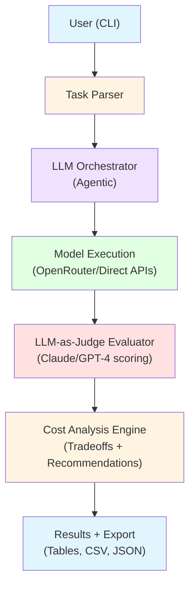

# LLM TaskBench - Project Overview

**Version:** 2.0 (MVP)  
**Author:** Sri Bolisetty (@KnightSri)  
**Last Updated:** November 2025  
**Timeline:** 6-8 weeks  
**Target Completion:** December 22, 2025  
**Demo Day:** January 17, 2026

---

## What is LLM TaskBench?

LLM TaskBench is a **task-first LLM evaluation framework** that enables domain experts to compare multiple LLMs on their actual use cases without requiring AI engineering expertise.

**The Problem It Solves:**

Existing LLM evaluation tools (DeepEval, Promptfoo, Eleuther AI) focus on generic benchmarks (BLEU, ROUGE) and are built for AI engineers, not domain experts. When a medical professional needs to know "which LLM best triages patient symptoms," or an educator wants "the most cost-effective model for lecture summarization," current tools provide unhelpful generic scores.

**The Solution:**

LLM TaskBench shifts evaluation from **metric-first to task-first**:
- Define YOUR actual task in YAML
- Evaluate 5+ models automatically  
- Get cost-aware recommendations

---

## Key Innovation

**Research-Validated Approach:** Based on comprehensive testing of 42 production LLMs on lecture transcript analysis, revealing surprising insights:

❌ **Conventional Wisdom is Wrong:**
- Model size doesn't correlate with quality (405B didn't beat 72B)
- "Reasoning-optimized" models can perform WORSE on reasoning tasks  
- Cost shows ZERO correlation with performance (36X price range)

✅ **What Actually Matters:**
- Fine-tuning proves more impactful than raw model size
- Mid-tier models often hit the quality/cost "sweet spot"
- Task-specific evaluation reveals model strengths/weaknesses

**Read the full research:** ["How a $3.45 API Call Taught Me Everything About LLM Cost Optimization"](https://www.linkedin.com/pulse/how-345-api-call-taught-me-everything-llm-cost-sri-bolisetty-vxate)

---

## Primary Use Case

**Lecture Transcript Concept Extraction**

Extract teaching concepts from lecture transcripts with:
- Precise timestamps (HH:MM:SS format)
- Duration constraints (2-7 minute segments)
- Descriptive concept names
- CSV output format

**Why This Task?**

It requires:
- Complex reasoning (understanding teaching flow)
- Precise text processing (accurate timestamps)
- Rule following (duration constraints)
- Structured output (clean CSV)

This combination reveals model capabilities beyond simple Q&A.

**Research Baseline (Claude Sonnet 4.5):**
- 24 concepts extracted from 3-hour lecture
- 0 violations (all segments 2-7 minutes)
- $0.36 per transcript
- 100% accuracy benchmark

---

## System Architecture



**Core Components:**

1. **Task Definition System** - Parse & validate YAML task specs
2. **Agentic Orchestrator** - LLM-driven evaluation planning
3. **LLM-as-Judge** - Meta-evaluation with structured scoring
4. **Cost Analyzer** - Real-time tracking + quality tradeoffs
5. **Results Presenter** - Professional output & export

---

## Technology Stack

- **Language:** Python 3.11+
- **CLI:** Typer (commands) + Rich (beautiful terminal output)
- **AI Gateway:** OpenRouter (30+ models, unified API)
- **Data Validation:** Pydantic (type safety)
- **HTTP Client:** httpx (async API calls)
- **Testing:** pytest (80%+ coverage target)
- **Type Safety:** mypy + Pydantic validation

---

## MVP Scope

**Must Have (Non-negotiable):**
- ✅ 1 built-in task (lecture analysis)
- ✅ 5 model evaluation capability
- ✅ LLM-as-judge scoring
- ✅ Cost tracking (accurate to $0.01)
- ✅ Basic CLI interface
- ✅ Basic recommendations
- ✅ 80% test coverage
- ✅ Demo video or live demo

**Can Drop if Timeline is Tight:**
- ❌ Second built-in task
- ❌ Multiple export formats (CSV is enough)
- ❌ Parallel execution (sequential is fine)
- ❌ Advanced CLI features
- ❌ PyPI publication
- ❌ Extensive documentation

---

## Success Metrics

**MVP Requirements:**

| Category | Metric | Target |
|----------|--------|--------|
| **Functionality** | Evaluation speed | 5+ models in <30 min |
| | Accuracy | Judge scores within ±10 points |
| | Cost tracking | Accurate to $0.01 |
| | Test coverage | 80%+ |
| **Quality** | Research validation | Align with 42-model study |
| | Recommendations | Actionable, not just scores |
| | User experience | First-time user success |
| | Code quality | Type hints, documented |
| **Portfolio** | Documentation | README + API docs |
| | Demo readiness | Zero critical bugs |
| | Architecture | Explainable in 2 min |
| | Professional | GitHub presence |

---

## Development Timeline

**Phase 0: Setup** ✅ Complete (Oct 20-24, 2025)
- Project structure, documentation, repository setup

**Phase 1: Core Framework** 🔜 Next (Oct 27 - Nov 10, 2025)
- Task definition system
- API client with retry logic
- Cost tracking
- Model executor
- Basic CLI

**Phase 2: Evaluation Engine** ⏳ Pending (Nov 11 - Nov 24, 2025)
- LLM-as-judge implementation
- Violation detection
- Multi-model comparison

**Phase 3: Analysis & Recs** ⏳ Pending (Nov 25 - Dec 8, 2025)
- Cost-quality tradeoff analysis
- Recommendation engine
- Tier identification

**Phase 4: Polish & Demo** ⏳ Pending (Dec 9 - Dec 22, 2025)
- Comprehensive testing
- Documentation
- Demo preparation
- Presentation creation

**Overall Progress:** 10% (Phase 0 complete)

---

## Key Features

### 1. Task-First Evaluation
Define your actual use case, not a proxy metric:
- Lecture concept extraction with timestamps
- Medical case triage
- Support ticket categorization  
- Contract analysis
- *Your domain-specific task*

### 2. LLM-as-Judge Quality Assessment
Let Claude/GPT-4 score outputs on *your* criteria:
- Accuracy scores (0-100)
- Format compliance
- Rule violation detection
- Reasoning for scores

### 3. Cost-Aware Recommendations
Balance quality and budget:
- Real-time token tracking (accurate to $0.01)
- Cost-quality tradeoff analysis
- Production vs. development recommendations
- "Sweet spot" identification

### 4. Research-Validated
Built on findings from testing 42 models:
- Results validated against published research
- No model size assumptions
- Real-world performance data
- Surprising insights documented

### 5. Agentic Architecture
Smart orchestration, not manual coordination:
- LLM creates evaluation plan
- Dynamic model selection
- Intelligent error handling
- Automated comparison

---

## Example Usage

```bash
# Define your task
$ cat lecture_analysis.yaml

# Evaluate multiple models
$ taskbench evaluate lecture_analysis.yaml \
  --models claude-sonnet-4.5,gpt-4o,gemini-2.5-pro,llama-3.1-405b,qwen-2.5-72b

# Results:
Evaluating Claude Sonnet 4.5... ✓ (24 concepts, 0 violations, $0.36)
Evaluating GPT-4o...           ✓ (23 concepts, 1 violation, $0.42)
Evaluating Gemini 2.5 Pro...   ✓ (22 concepts, 2 violations, $0.38)
Evaluating Llama 3.1 405B...   ✓ (20 concepts, 4 violations, $0.25)
Evaluating Qwen 2.5 72B...     ✓ (21 concepts, 3 violations, $0.18)

# Get recommendations
$ taskbench recommend

┌─────────────────────┬───────┬────────────┬──────────┬───────────┐
│ Model               │ Score │ Violations │ Cost     │ Tier      │
├─────────────────────┼───────┼────────────┼──────────┼───────────┤
│ Claude Sonnet 4.5   │ 98    │ 0          │ $0.36    │ Excellent │
│ GPT-4o              │ 95    │ 1          │ $0.42    │ Excellent │
│ Gemini 2.5 Pro      │ 92    │ 2          │ $0.38    │ Excellent │
│ Qwen 2.5 72B        │ 87    │ 3          │ $0.18    │ Good      │
│ Llama 3.1 405B      │ 83    │ 4          │ $0.25    │ Good      │
└─────────────────────┴───────┴────────────┴──────────┴───────────┘

📊 Recommendations:
  🏆 Best Overall: Claude Sonnet 4.5
  💎 Best Value: Qwen 2.5 72B (87% as good, 50% cheaper)
  💰 Budget Option: Qwen 2.5 72B
```

---

## Project Files Structure

```
llm-taskbench/
├── src/taskbench/           # Main package
│   ├── core/                # Task definitions, data models
│   ├── api/                 # OpenRouter client, retry logic
│   ├── evaluation/          # Executor, judge, cost tracking
│   ├── cli/                 # Command-line interface
│   └── utils/               # Logging, validation
├── tasks/                   # Built-in task definitions
├── tests/                   # Unit and integration tests
├── examples/                # Example tasks and outputs
├── config/                  # Model pricing database
├── docs/                    # Documentation
└── README.md               # Main documentation
```

---

## Critical Path to Success

**Week 1-2 (Phase 1): Foundation**
- MUST complete on time - everything depends on this
- Task parser, API client, cost tracking, basic executor

**Week 3 (Phase 2): Highest Risk**
- LLM-as-judge complexity - start simple
- Get scoring working, refinement can come later

**Week 7: Buffer Week**
- Use if behind schedule
- Catch up on testing or documentation

**Week 8: Polish Only**
- NO new features
- Only bug fixes and documentation
- Demo preparation

---

## Risk Mitigation

**Active Risks:**

| Risk | Mitigation |
|------|------------|
| API rate limits | Cache results, use free tier strategically |
| LLM-as-judge inconsistency | Manual validation, prompt refinement |
| Time overrun Phase 2 | Week 7 buffer, simplified judge for MVP |
| OpenRouter API changes | Abstraction layer, direct API fallbacks |
| Demo day technical issues | Video recording backup, screenshots |

---

## Post-MVP Roadmap

### Immediate (Weeks 9-10)
- Add 3rd built-in task (medical case analysis)
- Improve documentation
- Add Markdown report export
- Package for PyPI

### Phase 2 (Weeks 11+)
- Streamlit web interface
- Batch evaluation (50+ models)
- Historical tracking
- Custom judge LLM selection
- Integration with LangSmith/Helicone

### Community & Growth
- Open source on GitHub (MIT license)
- Blog post announcement
- HackerNews/Reddit posts
- Target: 100 GitHub stars in first month

---

## Demo Readiness Checklist

**Core Functionality:**
- [ ] YAML task parser working
- [ ] LLM orchestrator executes 5 models
- [ ] LLM-as-judge scores all outputs
- [ ] Cost tracking displays real-time costs
- [ ] Results presenter shows comparison table

**Quality Validation:**
- [ ] Judge scores match manual evaluation (±10 points)
- [ ] Token counting matches API billing (±$0.01)
- [ ] All 5 models complete without errors
- [ ] Results export to JSON and CSV

**Demo Path (10 minutes):**
1. Show task definition (1 min)
2. Run live evaluation (5 min)
3. Show results and recommendations (3 min)
4. Architecture explanation (1 min)

**Backup Plan:**
- Pre-recorded demo video
- Pre-computed results JSON
- Static screenshots

---

## Resources

**Project Documentation:**
- Technical Specification: `technical-spec.md`
- Vision Document: `LLMTaskBench-Vision.md`
- Task List: `claude-code-task-list.md`
- TODO Tracker: `Todo.md`

**Research:**
- Blog Post: ["How a $3.45 API Call Taught Me Everything About LLM Cost Optimization"](https://www.linkedin.com/pulse/how-345-api-call-taught-me-everything-llm-cost-sri-bolisetty-vxate)
- 42-Model Analysis: `analysis.csv`
- Model Data: `models.csv`

**External Tools:**
- OpenRouter: <https://openrouter.ai>
- Anthropic API: <https://docs.anthropic.com>
- OpenAI API: <https://platform.openai.com/docs>

---

## Contact

**Sri Bolisetty**
- GitHub: [@KnightSri](https://github.com/KnightSri)
- LinkedIn: [Profile](https://linkedin.com/in/sribolisetty)
- Project: AI Engineering Capstone

---

**Built with 🧠 by Sri Bolisetty**  
*Making LLM evaluation accessible to domain experts*