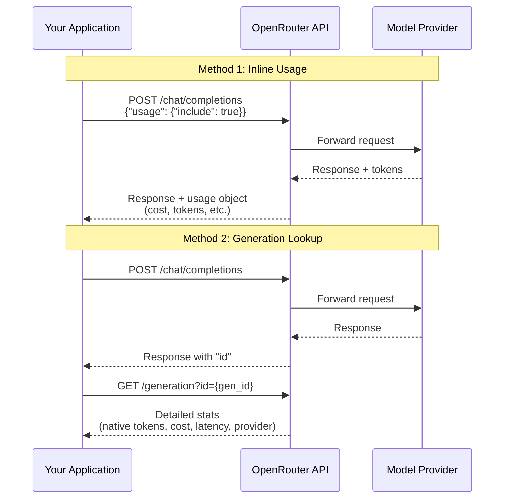

# OpenRouter API Cost Tracking Guide

> **Last Updated:** December 2025  
> **API Version:** v1

## Overview

OpenRouter provides two methods for tracking API costs programmatically:

1. **Inline Usage Accounting** - Get cost data directly in the API response
2. **Generation ID Lookup** - Query costs asynchronously after completion

This guide covers both approaches with working code examples.

---

## Method 1: Inline Usage Accounting (Recommended)

The simplest approach is to request usage data directly in your API call. This returns token counts and costs in the response without requiring a separate API call.

### How It Works

Add `"usage": {"include": true}` to your request body. The response will include detailed usage information including costs.

### Python Example (Non-Streaming)

```python
import requests
import os

OPENROUTER_API_KEY = os.environ.get("OPENROUTER_API_KEY")

def chat_with_cost_tracking(messages: list, model: str = "anthropic/claude-sonnet-4") -> dict:
    """Make an API call with inline cost tracking."""
    
    response = requests.post(
        "https://openrouter.ai/api/v1/chat/completions",
        headers={
            "Authorization": f"Bearer {OPENROUTER_API_KEY}",
            "Content-Type": "application/json",
            "HTTP-Referer": "https://your-app.com",  # Optional: for leaderboard
            "X-Title": "Your App Name"              # Optional: for leaderboard
        },
        json={
            "model": model,
            "messages": messages,
            "usage": {
                "include": True  # <-- Enable inline cost tracking
            }
        }
    )
    
    return response.json()


# Example usage
result = chat_with_cost_tracking([
    {"role": "user", "content": "What is the capital of France?"}
])

# Extract usage data
if "usage" in result:
    usage = result["usage"]
    print(f"Prompt tokens: {usage.get('prompt_tokens')}")
    print(f"Completion tokens: {usage.get('completion_tokens')}")
    print(f"Total tokens: {usage.get('total_tokens')}")
    print(f"Cost (credits): {usage.get('cost')}")
```

### Python Example (Streaming)

For streaming responses, usage information appears in the final SSE chunk:

```python
from openai import OpenAI

client = OpenAI(
    base_url="https://openrouter.ai/api/v1",
    api_key=os.environ.get("OPENROUTER_API_KEY"),
)

def stream_with_cost_tracking(messages: list, model: str = "anthropic/claude-sonnet-4"):
    """Stream responses and capture usage at the end."""
    
    response = client.chat.completions.create(
        model=model,
        messages=messages,
        extra_body={
            "usage": {
                "include": True
            }
        },
        stream=True
    )
    
    usage_data = None
    
    for chunk in response:
        # Check for usage data (appears in final chunk)
        if hasattr(chunk, 'usage') and chunk.usage:
            if hasattr(chunk.usage, 'total_tokens'):
                usage_data = {
                    "prompt_tokens": chunk.usage.prompt_tokens,
                    "completion_tokens": chunk.usage.completion_tokens,
                    "total_tokens": chunk.usage.total_tokens,
                    "cost": getattr(chunk.usage, 'cost', None)
                }
        # Print content as it streams
        elif chunk.choices and chunk.choices[0].delta.content:
            print(chunk.choices[0].delta.content, end="", flush=True)
    
    print()  # Newline after streaming
    return usage_data


# Example usage
usage = stream_with_cost_tracking([
    {"role": "user", "content": "Write a haiku about APIs."}
])

if usage:
    print(f"\n--- Usage Statistics ---")
    print(f"Total Tokens: {usage['total_tokens']}")
    print(f"Cost: {usage['cost']} credits")
```

### Response Format

When usage accounting is enabled, the response includes:

```json
{
  "id": "gen-xxxxxxxxxxxxxx",
  "choices": [...],
  "usage": {
    "prompt_tokens": 194,
    "completion_tokens": 25,
    "total_tokens": 219,
    "prompt_tokens_details": {
      "cached_tokens": 0,
      "audio_tokens": 0
    },
    "completion_tokens_details": {
      "reasoning_tokens": 0
    },
    "cost": 0.95,
    "cost_details": {
      "upstream_inference_cost": 19
    }
  }
}
```

### Field Definitions

| Field | Description |
|-------|-------------|
| `prompt_tokens` | Input tokens (includes images/tools if any) |
| `completion_tokens` | Generated output tokens |
| `total_tokens` | Sum of prompt + completion tokens |
| `cached_tokens` | Tokens read from cache (cost savings) |
| `reasoning_tokens` | Tokens used for reasoning (if applicable) |
| `cost` | Total amount charged to your account |
| `upstream_inference_cost` | Actual provider cost (BYOK only) |

---

## Method 2: Generation ID Lookup (Asynchronous)

For more detailed statistics or when you need to query costs after the fact, use the Generation API endpoint.

### How It Works

1. Make your chat completion request
2. Extract the `id` field from the response (format: `gen-xxxxxxxxxxxxxx`)
3. Query `/api/v1/generation?id={generation_id}` for detailed stats

### Python Implementation

```python
import requests
import time
import os

OPENROUTER_API_KEY = os.environ.get("OPENROUTER_API_KEY")

def make_api_call(messages: list, model: str = "anthropic/claude-sonnet-4") -> dict:
    """Make an API call and return the response with generation ID."""
    
    response = requests.post(
        "https://openrouter.ai/api/v1/chat/completions",
        headers={
            "Authorization": f"Bearer {OPENROUTER_API_KEY}",
            "Content-Type": "application/json"
        },
        json={
            "model": model,
            "messages": messages
        }
    )
    
    return response.json()


def get_generation_stats(generation_id: str, max_retries: int = 3, delay: float = 1.0) -> dict:
    """
    Query the generation endpoint for detailed cost and token statistics.
    
    Args:
        generation_id: The ID from the chat completion response
        max_retries: Number of retry attempts (stats may not be immediately available)
        delay: Seconds to wait between retries
    
    Returns:
        Generation statistics including native token counts and cost
    """
    
    for attempt in range(max_retries):
        response = requests.get(
            f"https://openrouter.ai/api/v1/generation?id={generation_id}",
            headers={
                "Authorization": f"Bearer {OPENROUTER_API_KEY}"
            }
        )
        
        if response.status_code == 200:
            return response.json()
        elif response.status_code == 404 and attempt < max_retries - 1:
            # Stats might not be available immediately
            time.sleep(delay)
            continue
        else:
            response.raise_for_status()
    
    return None


def complete_with_cost_analysis(messages: list, model: str = "anthropic/claude-sonnet-4") -> dict:
    """
    Make an API call and retrieve detailed cost analysis.
    
    Returns dict with:
        - response: The chat completion response
        - stats: Detailed generation statistics
    """
    
    # Step 1: Make the API call
    response = make_api_call(messages, model)
    
    if "id" not in response:
        return {"response": response, "stats": None, "error": "No generation ID in response"}
    
    generation_id = response["id"]
    
    # Step 2: Query for detailed stats (with small delay for processing)
    time.sleep(0.5)
    stats = get_generation_stats(generation_id)
    
    return {
        "response": response,
        "stats": stats
    }


# Example usage
result = complete_with_cost_analysis([
    {"role": "user", "content": "Explain quantum computing in one paragraph."}
])

print("=== Response ===")
print(result["response"]["choices"][0]["message"]["content"])

print("\n=== Cost Analysis ===")
if result["stats"] and "data" in result["stats"]:
    data = result["stats"]["data"]
    print(f"Model: {data.get('model')}")
    print(f"Provider: {data.get('provider_name')}")
    print(f"Total Cost: ${data.get('total_cost', 0):.6f}")
    print(f"Cache Discount: ${data.get('cache_discount', 0):.6f}")
    print(f"Prompt Tokens (native): {data.get('native_tokens_prompt')}")
    print(f"Completion Tokens (native): {data.get('native_tokens_completion')}")
    print(f"Reasoning Tokens: {data.get('native_tokens_reasoning', 0)}")
    print(f"Cached Tokens: {data.get('native_tokens_cached', 0)}")
    print(f"Latency: {data.get('latency')}ms")
    print(f"Generation Time: {data.get('generation_time')}ms")
```

### Generation API Response Format

```json
{
  "data": {
    "id": "gen-3bhGkxlo4XFrqiabUM7NDtwDzWwG",
    "upstream_id": "chatcmpl-791bcf62-080e-4568-87d0-94c72e3b4946",
    "total_cost": 0.0015,
    "cache_discount": 0.0002,
    "upstream_inference_cost": 0.0012,
    "created_at": "2024-07-15T23:33:19.433273+00:00",
    "model": "anthropic/claude-sonnet-4",
    "app_id": 12345,
    "streamed": true,
    "cancelled": false,
    "provider_name": "Anthropic",
    "latency": 1250,
    "moderation_latency": 50,
    "generation_time": 1200,
    "finish_reason": "stop",
    "tokens_prompt": 10,
    "tokens_completion": 25,
    "native_tokens_prompt": 10,
    "native_tokens_completion": 25,
    "native_tokens_completion_images": 0,
    "native_tokens_reasoning": 5,
    "native_tokens_cached": 3,
    "num_media_prompt": 1,
    "num_input_audio_prompt": 0,
    "num_media_completion": 0,
    "num_search_results": 5,
    "origin": "https://your-app.com/",
    "usage": 0.0015,
    "is_byok": false,
    "native_finish_reason": "stop",
    "external_user": "user-123",
    "api_type": "completions"
  }
}
```

### Key Fields in Generation Response

| Field | Description |
|-------|-------------|
| `total_cost` | Total cost in USD charged to your account |
| `cache_discount` | Amount saved via prompt caching |
| `upstream_inference_cost` | Provider's actual cost (BYOK only) |
| `native_tokens_prompt` | Input tokens using model's native tokenizer |
| `native_tokens_completion` | Output tokens using model's native tokenizer |
| `native_tokens_reasoning` | Reasoning tokens (for o1, etc.) |
| `native_tokens_cached` | Tokens served from cache |
| `provider_name` | Which provider handled the request |
| `latency` | Total request latency in ms |
| `generation_time` | Time spent generating tokens in ms |
| `finish_reason` | Normalized: `stop`, `length`, `tool_calls`, etc. |
| `native_finish_reason` | Raw finish reason from provider |

---

## Complete Cost Tracker Class

Here's a production-ready class combining both methods:

```python
"""
OpenRouter Cost Tracker
-----------------------
A complete solution for tracking API costs with OpenRouter.
"""

import requests
import time
import json
from dataclasses import dataclass, asdict
from typing import Optional, List, Dict, Any
from datetime import datetime
import os


@dataclass
class CostRecord:
    """Record of a single API call's cost."""
    generation_id: str
    model: str
    timestamp: str
    prompt_tokens: int
    completion_tokens: int
    total_tokens: int
    cost_usd: float
    cache_discount: float
    provider: str
    latency_ms: int
    
    def to_dict(self) -> dict:
        return asdict(self)


class OpenRouterCostTracker:
    """
    Track costs for OpenRouter API calls.
    
    Supports both inline usage tracking and async generation lookups.
    """
    
    def __init__(self, api_key: Optional[str] = None):
        self.api_key = api_key or os.environ.get("OPENROUTER_API_KEY")
        if not self.api_key:
            raise ValueError("API key required. Set OPENROUTER_API_KEY env var or pass to constructor.")
        
        self.base_url = "https://openrouter.ai/api/v1"
        self.cost_history: List[CostRecord] = []
    
    def _headers(self) -> dict:
        return {
            "Authorization": f"Bearer {self.api_key}",
            "Content-Type": "application/json"
        }
    
    def chat(
        self,
        messages: List[Dict[str, str]],
        model: str = "anthropic/claude-sonnet-4",
        track_usage: bool = True,
        **kwargs
    ) -> Dict[str, Any]:
        """
        Make a chat completion with optional cost tracking.
        
        Args:
            messages: List of message dicts with 'role' and 'content'
            model: Model identifier (e.g., 'anthropic/claude-sonnet-4')
            track_usage: Include usage data in response (adds ~100-300ms)
            **kwargs: Additional parameters (temperature, max_tokens, etc.)
        
        Returns:
            API response with usage data if track_usage=True
        """
        payload = {
            "model": model,
            "messages": messages,
            **kwargs
        }
        
        if track_usage:
            payload["usage"] = {"include": True}
        
        response = requests.post(
            f"{self.base_url}/chat/completions",
            headers=self._headers(),
            json=payload
        )
        response.raise_for_status()
        
        result = response.json()
        
        # Record cost if available
        if track_usage and "usage" in result and "id" in result:
            self._record_inline_cost(result, model)
        
        return result
    
    def get_generation_stats(self, generation_id: str, retries: int = 3) -> Optional[Dict]:
        """
        Query detailed stats for a generation.
        
        Args:
            generation_id: The 'id' from a chat completion response
            retries: Number of retry attempts
        
        Returns:
            Generation statistics or None if not found
        """
        for attempt in range(retries):
            response = requests.get(
                f"{self.base_url}/generation",
                headers=self._headers(),
                params={"id": generation_id}
            )
            
            if response.status_code == 200:
                return response.json()
            elif response.status_code == 404 and attempt < retries - 1:
                time.sleep(0.5)
            else:
                break
        
        return None
    
    def _record_inline_cost(self, response: dict, model: str):
        """Record cost from inline usage data."""
        usage = response.get("usage", {})
        
        record = CostRecord(
            generation_id=response.get("id", "unknown"),
            model=model,
            timestamp=datetime.utcnow().isoformat(),
            prompt_tokens=usage.get("prompt_tokens", 0),
            completion_tokens=usage.get("completion_tokens", 0),
            total_tokens=usage.get("total_tokens", 0),
            cost_usd=usage.get("cost", 0),
            cache_discount=0,  # Not available in inline
            provider="unknown",  # Not available in inline
            latency_ms=0  # Not available in inline
        )
        
        self.cost_history.append(record)
    
    def record_from_generation(self, generation_id: str) -> Optional[CostRecord]:
        """
        Fetch and record detailed stats from a generation ID.
        
        Use this for more detailed cost tracking including provider
        and latency information.
        """
        stats = self.get_generation_stats(generation_id)
        
        if not stats or "data" not in stats:
            return None
        
        data = stats["data"]
        
        record = CostRecord(
            generation_id=data.get("id", generation_id),
            model=data.get("model", "unknown"),
            timestamp=data.get("created_at", datetime.utcnow().isoformat()),
            prompt_tokens=data.get("native_tokens_prompt", 0),
            completion_tokens=data.get("native_tokens_completion", 0),
            total_tokens=data.get("native_tokens_prompt", 0) + data.get("native_tokens_completion", 0),
            cost_usd=data.get("total_cost", 0),
            cache_discount=data.get("cache_discount", 0),
            provider=data.get("provider_name", "unknown"),
            latency_ms=data.get("latency", 0)
        )
        
        self.cost_history.append(record)
        return record
    
    def get_total_cost(self) -> float:
        """Get total cost across all recorded calls."""
        return sum(r.cost_usd for r in self.cost_history)
    
    def get_cost_by_model(self) -> Dict[str, float]:
        """Get cost breakdown by model."""
        costs = {}
        for record in self.cost_history:
            costs[record.model] = costs.get(record.model, 0) + record.cost_usd
        return costs
    
    def export_history(self, filepath: str):
        """Export cost history to JSON file."""
        with open(filepath, "w") as f:
            json.dump([r.to_dict() for r in self.cost_history], f, indent=2)
    
    def print_summary(self):
        """Print a summary of costs."""
        print(f"\n{'='*50}")
        print("COST SUMMARY")
        print(f"{'='*50}")
        print(f"Total Calls: {len(self.cost_history)}")
        print(f"Total Cost: ${self.get_total_cost():.6f}")
        print(f"\nBy Model:")
        for model, cost in self.get_cost_by_model().items():
            print(f"  {model}: ${cost:.6f}")
        print(f"{'='*50}\n")


# Example usage
if __name__ == "__main__":
    tracker = OpenRouterCostTracker()
    
    # Make some API calls
    result1 = tracker.chat(
        messages=[{"role": "user", "content": "What is 2+2?"}],
        model="anthropic/claude-sonnet-4"
    )
    print(f"Response 1: {result1['choices'][0]['message']['content']}")
    
    result2 = tracker.chat(
        messages=[{"role": "user", "content": "Write a limerick about code."}],
        model="openai/gpt-4o"
    )
    print(f"Response 2: {result2['choices'][0]['message']['content']}")
    
    # Print cost summary
    tracker.print_summary()
    
    # Export to file
    tracker.export_history("cost_history.json")
```

---

## Checking Account Credits

To check remaining credits on your API key:

```python
def check_credits(api_key: str) -> dict:
    """Check remaining credits and rate limits."""
    response = requests.get(
        "https://openrouter.ai/api/v1/auth/key",
        headers={"Authorization": f"Bearer {api_key}"}
    )
    return response.json()


# Response format:
# {
#   "data": {
#     "label": "My API Key",
#     "usage": 15.50,         # Credits used
#     "limit": 100.00,        # Credit limit (null if unlimited)
#     "is_free_tier": false,  # Whether user has purchased credits
#     "rate_limit": {
#       "requests": 200,      # Requests allowed
#       "interval": "10s"     # In this time interval
#     }
#   }
# }
```

---

## Important Notes

### Token Counting Differences

- **Inline `usage` field**: Uses normalized GPT-4o tokenizer (not model-native)
- **Generation endpoint**: Uses model's **native tokenizer** (more accurate)
- **Billing**: Always based on native token counts

For accurate cost tracking, prefer the Generation endpoint when precision matters.

### Performance Impact

Enabling inline usage tracking adds approximately 100-300ms to responses as the API calculates token counts and costs. This only affects the final response timing.

### Pricing Reference

OpenRouter passes through provider pricing with no markup on inference. Current pricing for popular models:

| Model | Input (per 1M) | Output (per 1M) |
|-------|----------------|-----------------|
| Claude Sonnet 4 | $3.00 | $15.00 |
| Claude Haiku 4 | $0.25 | $1.25 |
| GPT-4o | $2.50 | $10.00 |
| GPT-4o-mini | $0.15 | $0.60 |

*Note: Prices change frequently. Check [openrouter.ai/models](https://openrouter.ai/models) for current pricing.*

---

## Architecture Diagram



---

## References

- [OpenRouter Usage Accounting Docs](https://openrouter.ai/docs/use-cases/usage-accounting)
- [OpenRouter Generation API](https://openrouter.ai/docs/api-reference/get-a-generation)
- [OpenRouter API Reference](https://openrouter.ai/docs/api/reference/overview)
- [OpenRouter Models & Pricing](https://openrouter.ai/models)
