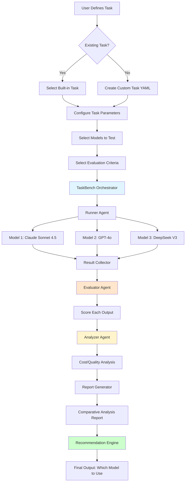
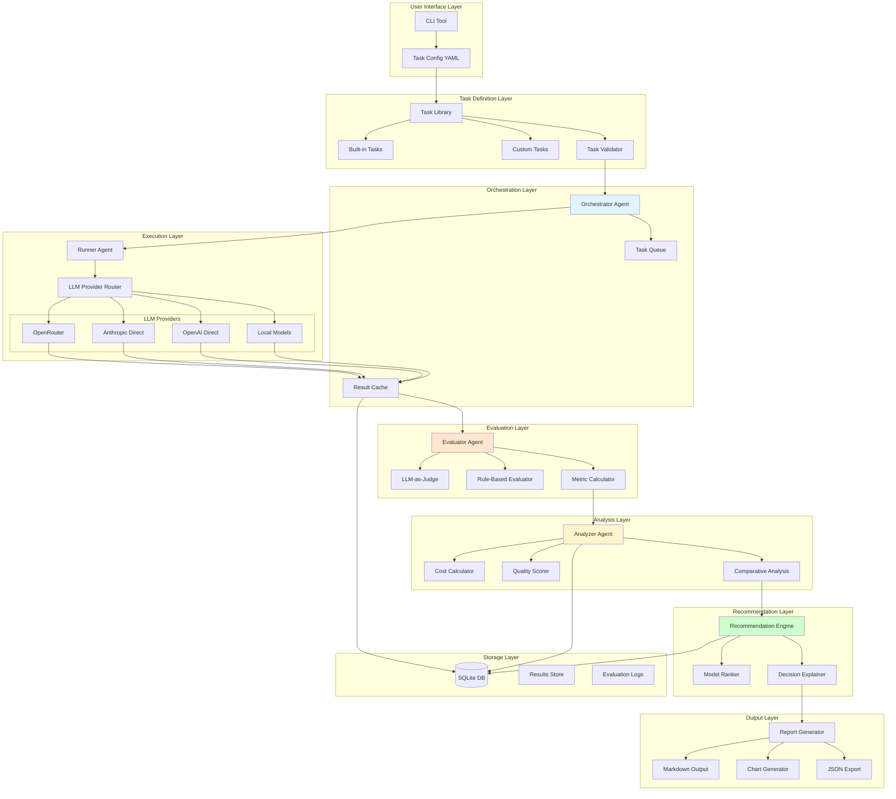
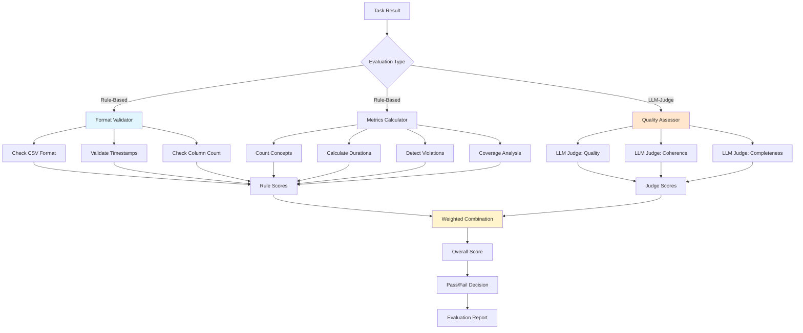

# LLM TaskBench - Technical Specification

**Project:** Task-Specific LLM Evaluation Framework  
**Version:** 1.0 (MVP Phase)  
**Author:** Sri  
**Date:** October 24, 2025  
**Tagline:** "Evaluate LLMs for YOUR task, not generic benchmarks"

---

## Table of Contents

1. [Executive Summary](#executive-summary)
2. [System Overview](#system-overview)
3. [Differentiation from Existing Solutions](#differentiation-from-existing-solutions)
4. [Architecture](#architecture)
5. [Task Definition System](#task-definition-system)
6. [Core Components](#core-components)
7. [Built-in Tasks](#built-in-tasks)
8. [Technology Stack](#technology-stack)
9. [Data Schemas](#data-schemas)
10. [CLI Interface](#cli-interface)
11. [Evaluation Engine](#evaluation-engine)
12. [Analysis & Reporting](#analysis--reporting)
13. [Extension System](#extension-system)
14. [Testing Strategy](#testing-strategy)
15. [Deployment & Distribution](#deployment--distribution)
16. [MVP Scope](#mvp-scope)
17. [Future Roadmap](#future-roadmap)

---

## Executive Summary

### The Problem

LLM evaluation tools focus on generic benchmarks (MMLU, HumanEval) or require users to understand complex metrics. Domain experts—educators, medical professionals, legal teams, customer support managers—need to evaluate LLMs for **their specific tasks**, not academic benchmarks.

### The Solution

**LLM TaskBench** is a task-first evaluation framework where users:
1. Define their specific task (or use built-in tasks)
2. Specify evaluation criteria relevant to their domain
3. Run automated evaluation across multiple models
4. Receive cost-aware recommendations with comparative analysis

### Key Innovation

**Task-First vs Metric-First:**
- **Existing tools:** "Here are 14 metrics, figure out which ones apply to your use case"
- **TaskBench:** "What's your task? We'll evaluate models for it"

### Target Users

- **Educators** evaluating models for course content generation
- **Medical professionals** assessing clinical documentation tools
- **Legal teams** testing contract analysis systems
- **Customer support** benchmarking ticket categorization
- **Researchers** creating reproducible domain-specific benchmarks

### Success Criteria (MVP)

1. Framework supports 3 built-in tasks (lecture analysis + 2 others)
2. Runs evaluation across 5+ models (via OpenRouter/direct APIs)
3. Generates comparative analysis with cost/quality recommendations
4. CLI tool with <5 minute setup time
5. Documentation that non-AI experts can follow

---

## System Overview

### Core Workflow



### Key Principles

1. **Task-Centric:** Tasks are first-class citizens, not afterthoughts
2. **Domain-Specific:** Built for real-world use cases, not academic papers
3. **Cost-Aware:** Every evaluation includes cost analysis
4. **Recommendation-Driven:** Don't just score—recommend which model to use
5. **Extensible:** Easy to add new tasks, models, and evaluation criteria
6. **Reproducible:** All evaluations are fully logged and reproducible

---

## Differentiation from Existing Solutions

### Comprehensive Comparison Matrix

| Feature | **TaskBench** | DeepEval | Promptfoo | Eleuther AI | LangSmith |
|---------|---------------|----------|-----------|-------------|-----------|
| **Philosophy** | Task-first | Metric-first | Prompt-first | Benchmark-first | Observability-first |
| **Target Users** | Domain experts | AI engineers | Developers | Researchers | LangChain users |
| **Approach** | "What's your task?" | "Pick metrics" | "Test prompts" | "Run 200 benchmarks" | "Monitor production" |
| **Custom Tasks** | ✅✅ Core feature | ⚠️ Via custom metrics | ⚠️ Via YAML | ❌ Pre-defined only | ⚠️ Via evaluators |
| **Built-in Domain Tasks** | ✅✅ Education, Medical, Legal | ❌ Generic only | ❌ Generic only | ❌ Academic only | ❌ Generic only |
| **Cost Analysis** | ✅✅ Built-in, comparative | ⚠️ Basic tracking | ⚠️ Per-provider | ❌ Not included | ✅ Via tracing |
| **Recommendations** | ✅✅ "Use Model X because..." | ❌ Scores only | ❌ Scores only | ❌ Scores only | ❌ Monitoring only |
| **Educational Focus** | ✅✅ Built for educators | ❌ | ❌ | ❌ | ❌ |
| **Setup Complexity** | ✅ <5 min (pip install) | ⚠️ Medium (Python) | ✅ Low (CLI) | ❌ High (research tool) | ⚠️ Managed service |
| **LLM Provider Support** | ✅ OpenRouter, Anthropic, OpenAI, Local | ✅ Any LLM | ✅ 50+ providers | ⚠️ Limited | ✅ Via LangChain |
| **Evaluation Approach** | LLM-as-judge + rule-based | LLM-as-judge | LLM-as-judge + custom | Academic metrics | Custom evaluators |
| **Output Format** | Markdown reports + charts | JSON + web UI | Web UI + CLI | JSON scores | Dashboard |
| **Open Source** | ✅ Apache 2.0 | ✅ Apache 2.0 | ✅ MIT | ✅ MIT | ⚠️ Managed service |
| **Community Tasks** | ✅✅ Task marketplace | ❌ | ❌ | ❌ | ❌ |

### What TaskBench Does Differently

#### 1. **Task Library, Not Metric Library**

**DeepEval Approach:**
```python
# User must understand which metrics apply
from deepeval.metrics import (
    HallucinationMetric,
    ToxicityMetric,
    AnswerRelevancyMetric,
    # ... 11 more metrics
)

# User picks metrics
metrics = [HallucinationMetric(), AnswerRelevancyMetric()]
```

**TaskBench Approach:**
```bash
# User describes their task
taskbench init --task lecture-transcript-analysis

# Framework knows what to evaluate
# - Concept count (target: 20-30)
# - Segment duration (2-7 minutes)
# - Content coverage (no gaps >5 minutes)
# - Timestamp accuracy
```

#### 2. **Domain-Specific vs Generic**

**Existing Tools:**
- MMLU (academic knowledge)
- HumanEval (code generation)
- TruthfulQA (factuality)
- GSM8K (grade school math)

**TaskBench:**
- Lecture transcript analysis (education)
- Medical case extraction (healthcare)
- Contract clause identification (legal)
- Support ticket categorization (customer service)
- Meeting notes generation (business)

#### 3. **Recommendations, Not Just Scores**

**Existing Tools Output:**
```
Model A: 0.82
Model B: 0.76
Model C: 0.91
```
(User must interpret what this means)

**TaskBench Output:**
```
╔═══════════════════════════════════════════════════════════╗
║          RECOMMENDATION FOR: Lecture Analysis             ║
╠═══════════════════════════════════════════════════════════╣
║ ✅ BEST CHOICE: Claude Sonnet 4.5                        ║
║    Reason: Highest quality, worth the premium             ║
║    - 24/24 concepts extracted (100%)                      ║
║    - 0 rule violations                                    ║
║    - Cost: $0.36 per lecture                             ║
║    - Quality score: 10/10                                ║
╠═══════════════════════════════════════════════════════════╣
║ 💰 BUDGET OPTION: Claude Sonnet 4                        ║
║    Reason: 50% cheaper, 90% quality                       ║
║    - 22/24 concepts extracted (92%)                       ║
║    - 7 minor violations (too short, easily fixable)      ║
║    - Cost: $0.18 per lecture                             ║
║    - Quality score: 7/10                                 ║
╠═══════════════════════════════════════════════════════════╣
║ ❌ NOT RECOMMENDED: Claude Haiku 4                       ║
║    Reason: Too many errors, not worth savings             ║
║    - 17/24 concepts extracted (71%)                       ║
║    - 11 violations (segments too long, missed content)   ║
║    - Cost: $0.03 per lecture                             ║
║    - Quality score: 4/10                                 ║
║    - Manual cleanup time > cost savings                   ║
╠═══════════════════════════════════════════════════════════╣
║ 📊 COST PROJECTION (50 lectures/semester):                ║
║    - Best Choice:   $18.00 ($0.36 × 50)                  ║
║    - Budget Option: $9.00  ($0.18 × 50)                  ║
║    - Not Worth:     $1.50  ($0.03 × 50) + cleanup hours  ║
╚═══════════════════════════════════════════════════════════╝
```

#### 4. **Accessibility for Non-Engineers**

**DeepEval:** Requires Python expertise, understanding of LLM evaluation metrics
**Promptfoo:** Developer-friendly but still requires YAML/CLI knowledge
**TaskBench:** Educators, medical professionals, legal teams can use it

Example: Educator workflow
```bash
# Install
pip install taskbench

# Select task
taskbench init --task lecture-analysis

# Add your data
taskbench add-sample my-lecture-transcript.txt

# Run evaluation
taskbench run --models claude-sonnet-4.5,gpt-4o,deepseek-v3

# Get recommendation
taskbench recommend
```

#### 5. **Built-in Cost Analysis**

All existing tools treat cost as an afterthought. TaskBench makes it central:

- Real-time cost tracking during evaluation
- Cost per task (not just per token)
- Semester/month cost projections
- Cost-quality trade-off analysis
- "Is the premium model worth it?" recommendations

---

## Architecture

### High-Level Architecture



### Component Details

#### 1. **Task Definition System**

Tasks are defined in YAML and contain:
- Task metadata (name, description, domain)
- Input requirements (what data is needed)
- Evaluation criteria (what makes a good output)
- Scoring rules (how to measure quality)
- Expected output format

#### 2. **Orchestrator Agent**

Responsibilities:
- Load and validate task definitions
- Manage model selection
- Coordinate parallel execution across models
- Handle retries and error recovery
- Track progress and costs in real-time

#### 3. **Runner Agent**

Responsibilities:
- Execute tasks across multiple LLM providers
- Handle provider-specific API calls
- Manage rate limits and quotas
- Cache results to avoid duplicate API calls
- Log all requests/responses for reproducibility

#### 4. **Evaluator Agent**

Uses two evaluation approaches:
- **LLM-as-Judge:** For subjective criteria (quality, coherence, helpfulness)
- **Rule-Based:** For objective criteria (format, length, specific requirements)

Responsibilities:
- Score each model's output
- Provide reasoning for scores
- Identify specific violations or issues
- Calculate aggregate quality metrics

#### 5. **Analyzer Agent**

Responsibilities:
- Compare results across models
- Calculate cost per task
- Identify cost-quality trade-offs
- Generate statistical comparisons
- Detect patterns and insights

#### 6. **Recommendation Engine**

Responsibilities:
- Rank models by suitability
- Generate recommendations with reasoning
- Calculate ROI (time saved vs cost)
- Provide "What if?" projections
- Explain trade-offs clearly

---

## Task Definition System

### Task YAML Structure

```yaml
task_id: "lecture-transcript-analysis"
version: "1.0"
name: "Lecture Transcript Analysis"
description: "Extract teaching concepts from lecture transcripts with timestamps"
domain: "education"
author: "Sri"
created: "2025-10-24"

# What this task requires as input
inputs:
  required:
    - name: "transcript"
      type: "text"
      description: "Lecture transcript with timestamps"
      format: "SRT or plain text with timestamps"
      max_size: "500KB"
  optional:
    - name: "course_context"
      type: "text"
      description: "Course name and session number"

# The prompt/task to give LLMs
task_prompt:
  template: |
    You are analyzing a lecture transcript to extract distinct teaching concepts.
    
    Transcript:
    {transcript}
    
    Course Context: {course_context}
    
    Extract all distinct teaching concepts from this lecture. For each concept:
    1. Give it a descriptive name (e.g., "01_Introduction_to_APIs")
    2. Identify the start timestamp
    3. Identify the end timestamp
    
    CRITICAL RULES:
    - Each concept should be 3-6 minutes long (ideal)
    - Minimum duration: 2 minutes (combine shorter segments)
    - Maximum duration: 7 minutes (split longer sections)
    - No gaps larger than 5 minutes between concepts
    - Timestamps must be accurate to the second
    
    Output format: CSV with columns (concept,start_time,end_time)
  
  variables:
    - transcript
    - course_context

# How to evaluate the output
evaluation_criteria:
  # Rule-based criteria (objective)
  rules:
    - name: "output_format"
      description: "Output must be valid CSV with 3 columns"
      type: "format_check"
      weight: 0.1
      
    - name: "minimum_concepts"
      description: "Must extract at least 18 concepts from 3-hour lecture"
      type: "count_check"
      min_value: 18
      weight: 0.2
      
    - name: "segment_duration_min"
      description: "No segment shorter than 2 minutes"
      type: "duration_check"
      min_duration: 120  # seconds
      weight: 0.2
      
    - name: "segment_duration_max"
      description: "No segment longer than 7 minutes"
      type: "duration_check"
      max_duration: 420  # seconds
      weight: 0.2
      
    - name: "content_coverage"
      description: "No gaps larger than 5 minutes"
      type: "gap_check"
      max_gap: 300  # seconds
      weight: 0.15
      
    - name: "timestamp_accuracy"
      description: "Timestamps must exist in transcript"
      type: "timestamp_validation"
      weight: 0.15
  
  # LLM-as-judge criteria (subjective)
  llm_judge:
    - name: "concept_quality"
      description: "Are concept names clear and descriptive?"
      rubric: |
        Score 1-10 based on:
        - Names are specific and informative
        - Easy to understand what will be taught
        - Follow consistent naming convention
      weight: 0.3
      
    - name: "logical_segmentation"
      description: "Do segments represent coherent teaching units?"
      rubric: |
        Score 1-10 based on:
        - Each segment covers one main concept
        - Segments don't cut off mid-explanation
        - Natural teaching flow is preserved
      weight: 0.4
      
    - name: "completeness"
      description: "Was all important content captured?"
      rubric: |
        Score 1-10 based on:
        - No major topics were skipped
        - All teaching moments identified
        - Appropriate granularity for the content
      weight: 0.3

# Expected output structure
expected_output:
  format: "csv"
  columns:
    - name: "concept"
      type: "string"
      description: "Descriptive concept name"
    - name: "start_time"
      type: "timestamp"
      format: "HH:MM:SS"
    - name: "end_time"
      type: "timestamp"
      format: "HH:MM:SS"
  
  example: |
    concept,start_time,end_time
    01_Introduction_to_REST_APIs,00:05:30,00:10:15
    02_HTTP_Methods_GET_POST,00:10:15,00:15:45
    03_Status_Codes_and_Responses,00:15:45,00:21:30

# Metadata for task discovery
tags:
  - education
  - lecture-analysis
  - video-processing
  - transcript-analysis

# Reference/baseline results (optional)
baseline:
  model: "claude-sonnet-4.5"
  concepts_extracted: 24
  violations: 0
  cost_usd: 0.36
  quality_score: 10.0
  notes: "Gold standard - perfect execution"

# Cost estimates for planning
cost_estimates:
  typical_input_tokens: 120000
  typical_output_tokens: 3000
  estimated_cost_range: "$0.15 - $0.50"
```

### Task Discovery & Management

```bash
# List available tasks
taskbench list

# View task details
taskbench describe lecture-transcript-analysis

# Search tasks by domain
taskbench search --domain education

# Create new task from template
taskbench create-task --template basic --name my-custom-task

# Validate task definition
taskbench validate my-custom-task.yaml

# Share task (export to file)
taskbench export lecture-transcript-analysis > my-task.yaml

# Import community task
taskbench import community/medical-case-extraction.yaml
```

---

## Core Components

### 1. Orchestrator Agent

**Purpose:** Coordinates the entire evaluation workflow

**Key Methods:**
```python
class OrchestratorAgent:
    def __init__(self, task_config, model_list, cache_dir):
        self.task = load_task(task_config)
        self.models = model_list
        self.cache = ResultCache(cache_dir)
        
    def run_evaluation(self, samples: List[Dict]) -> EvaluationResults:
        """
        Main evaluation loop:
        1. Validate inputs
        2. Run task across all models (parallel)
        3. Collect results
        4. Trigger evaluation
        5. Generate analysis
        6. Return results
        """
        
    def validate_inputs(self, samples):
        """Ensure samples match task requirements"""
        
    def execute_parallel(self, samples):
        """Run task on all models simultaneously"""
        
    def handle_errors(self, error, model, sample):
        """Retry logic and error recovery"""
```

### 2. Runner Agent

**Purpose:** Execute tasks on specific LLM providers

**Key Methods:**
```python
class RunnerAgent:
    def __init__(self, provider_config):
        self.provider = self.init_provider(provider_config)
        self.rate_limiter = RateLimiter()
        
    def execute_task(self, task, sample, model_name) -> TaskResult:
        """
        1. Format prompt from task template
        2. Call LLM API
        3. Parse response
        4. Track cost and latency
        5. Return structured result
        """
        
    def format_prompt(self, task, sample):
        """Inject sample data into prompt template"""
        
    def call_llm(self, prompt, model_name):
        """Handle API call with retries"""
        
    def parse_response(self, raw_response, expected_format):
        """Extract structured output"""
        
    def track_metrics(self, response):
        """Record cost, tokens, latency"""
```

### 3. Evaluator Agent

**Purpose:** Score model outputs against criteria

**Key Methods:**
```python
class EvaluatorAgent:
    def __init__(self, evaluation_criteria, judge_model="claude-sonnet-4"):
        self.criteria = evaluation_criteria
        self.judge = self.init_judge(judge_model)
        
    def evaluate_output(self, task_result, task_config) -> EvaluationScore:
        """
        1. Run rule-based evaluations
        2. Run LLM-as-judge evaluations
        3. Combine scores
        4. Generate reasoning
        """
        
    def rule_based_eval(self, output, rules):
        """Check objective criteria (format, length, etc.)"""
        
    def llm_judge_eval(self, output, rubric):
        """Use LLM to score subjective criteria"""
        
    def combine_scores(self, rule_scores, judge_scores, weights):
        """Weighted combination of all scores"""
        
    def generate_reasoning(self, scores):
        """Explain why this score was given"""
```

### 4. Analyzer Agent

**Purpose:** Compare results and identify patterns

**Key Methods:**
```python
class AnalyzerAgent:
    def __init__(self, results):
        self.results = results
        
    def comparative_analysis(self) -> ComparisonReport:
        """
        1. Rank models by quality
        2. Calculate cost per task
        3. Identify cost-quality trade-offs
        4. Find patterns and outliers
        """
        
    def cost_analysis(self):
        """Break down costs per model"""
        
    def quality_analysis(self):
        """Compare quality metrics"""
        
    def trade_off_analysis(self):
        """Cost vs quality scatter plot + insights"""
        
    def generate_insights(self):
        """Automated insights from data"""
```

### 5. Recommendation Engine

**Purpose:** Provide actionable recommendations

**Key Methods:**
```python
class RecommendationEngine:
    def __init__(self, analysis_results):
        self.analysis = analysis_results
        
    def generate_recommendations(self) -> List[Recommendation]:
        """
        1. Rank models
        2. Identify best choice
        3. Identify budget option
        4. Flag models to avoid
        5. Generate reasoning
        """
        
    def rank_models(self):
        """Multi-criteria ranking algorithm"""
        
    def identify_best(self):
        """Find optimal model for this task"""
        
    def identify_budget(self):
        """Find best value-for-money option"""
        
    def explain_recommendation(self, model, reason):
        """Generate human-readable explanation"""
        
    def calculate_roi(self):
        """Time saved vs cost analysis"""
```

---

## Built-in Tasks

### MVP Task Library (3 Tasks)

#### Task 1: Lecture Transcript Analysis (Flagship)
- **Domain:** Education
- **Input:** Lecture transcript with timestamps
- **Output:** CSV of teaching concepts with time ranges
- **Criteria:** 
  - Concept count (18-30 for 3-hour lecture)
  - Segment duration (2-7 minutes)
  - No content gaps >5 minutes
  - Timestamp accuracy
- **Use Case:** Educators creating study guides, video chapters
- **Your Research:** This is your completed research

#### Task 2: Customer Support Ticket Categorization
- **Domain:** Customer Service
- **Input:** Support ticket text
- **Output:** Category, priority, suggested response template
- **Criteria:**
  - Category accuracy (technical/billing/account/general)
  - Priority assignment (urgent/high/medium/low)
  - Response template relevance
  - Processing time <2 seconds
- **Use Case:** Support teams routing tickets automatically
- **Why This:** Common business use case, easy to understand

#### Task 3: Medical Case Summary Extraction
- **Domain:** Healthcare (HIPAA-compliant sample data)
- **Input:** Patient case notes
- **Output:** Structured summary (symptoms, diagnosis, treatment plan)
- **Criteria:**
  - Completeness (all symptoms captured)
  - Accuracy (no hallucinated information)
  - Structure (follows medical documentation standards)
  - Privacy (no PII leakage in model explanation)
- **Use Case:** Medical professionals documenting consultations
- **Why This:** High-stakes domain, showcases safety evaluation

### Future Tasks (Community Contributions)

- Legal contract clause extraction
- Meeting notes generation from transcripts
- Code documentation generation
- Research paper summarization
- Product review sentiment analysis
- Interview transcript analysis

---

## Technology Stack

### Core Framework
- **Python 3.10+** (primary language)
- **LangChain** (LLM orchestration, prompt templates)
- **LangGraph** (workflow state management, agent coordination)
- **LangSmith** (observability, cost tracking, prompt debugging)

### LLM Provider Integration
- **OpenRouter** (primary - 100+ models in one API)
- **Anthropic SDK** (direct Claude API access)
- **OpenAI SDK** (direct GPT API access)
- **Ollama** (local model support)

### CLI & UX
- **Typer** (CLI framework)
- **Rich** (beautiful terminal UI, progress bars, tables)
- **Click** (command parsing)

### Data & Storage
- **SQLite** (local results database)
- **Pandas** (data analysis, CSV handling)
- **Pydantic** (data validation, task schemas)

### Output & Reporting
- **Python-Markdown** (Markdown report generation)
- **Matplotlib/Plotly** (cost-quality charts)
- **Tabulate** (CLI tables)
- **Jinja2** (report templates)

### Testing & Quality
- **Pytest** (unit and integration tests)
- **Pytest-mock** (mocking LLM calls)
- **Pytest-cov** (code coverage)

### Distribution
- **Poetry** (dependency management)
- **PyPI** (package distribution)
- **GitHub Actions** (CI/CD)

---

## Data Schemas

### Task Result Schema

```python
from pydantic import BaseModel, Field
from typing import List, Dict, Optional
from datetime import datetime

class TaskResult(BaseModel):
    """Result from running a task on one model"""
    task_id: str
    model_name: str
    sample_id: str
    timestamp: datetime
    
    # Input
    input_data: Dict
    prompt_used: str
    
    # Output
    raw_output: str
    parsed_output: Optional[Dict] = None
    
    # Metrics
    input_tokens: int
    output_tokens: int
    total_tokens: int
    cost_usd: float
    latency_ms: int
    
    # Status
    status: str  # success, failed, partial
    error_message: Optional[str] = None
    
    # Metadata
    provider: str
    model_version: str
    temperature: float = 0.3

class EvaluationScore(BaseModel):
    """Evaluation scores for a task result"""
    task_result_id: str
    model_name: str
    
    # Rule-based scores
    rule_scores: Dict[str, float]  # {rule_name: score}
    rule_violations: List[str]
    
    # LLM-judge scores
    judge_scores: Dict[str, float]  # {criterion: score}
    judge_reasoning: Dict[str, str]
    
    # Aggregate
    overall_score: float  # 0-10
    quality_grade: str  # A, B, C, D, F
    
    # Pass/Fail
    passed: bool
    failure_reasons: List[str]

class ComparisonReport(BaseModel):
    """Comparative analysis across models"""
    task_id: str
    models_tested: List[str]
    
    # Rankings
    quality_ranking: List[str]  # Models by quality score
    cost_ranking: List[str]  # Models by cost
    speed_ranking: List[str]  # Models by latency
    
    # Best choices
    best_quality: str
    best_value: str  # Best cost-quality ratio
    fastest: str
    
    # Statistics
    avg_cost: float
    cost_range: tuple  # (min, max)
    quality_range: tuple
    
    # Insights
    insights: List[str]
    warnings: List[str]

class Recommendation(BaseModel):
    """Recommendation for which model to use"""
    model_name: str
    recommendation_type: str  # best, budget, avoid
    
    # Reasoning
    reason: str
    pros: List[str]
    cons: List[str]
    
    # Metrics
    quality_score: float
    cost_per_task: float
    reliability: float
    
    # Use case
    best_for: List[str]  # ["high-quality work", "production use"]
    not_recommended_for: List[str]
    
    # ROI
    time_saved_hours: Optional[float]
    cost_per_hour: Optional[float]
    roi_percentage: Optional[float]
```

---

## CLI Interface

### Command Structure

```bash
# Installation
pip install taskbench

# Initialize (first-time setup)
taskbench init
# Prompts for:
# - API keys (OpenRouter, Anthropic, OpenAI)
# - Default models
# - Cache directory

# Task Management
taskbench list                          # List all available tasks
taskbench describe <task-id>            # Show task details
taskbench search --domain education     # Find tasks by domain
taskbench create-task                   # Interactive task creator
taskbench validate task.yaml            # Validate task definition

# Running Evaluations
taskbench run \
  --task lecture-transcript-analysis \
  --input my-lecture.txt \
  --models claude-sonnet-4.5,gpt-4o,deepseek-v3 \
  --output results/

# With custom task
taskbench run \
  --task-file my-custom-task.yaml \
  --input data/ \
  --models all  # Use all configured models

# Watch mode (live updates)
taskbench run --task lecture-analysis --input data/ --watch

# Analysis
taskbench analyze results/evaluation-2025-10-24/
taskbench recommend results/evaluation-2025-10-24/
taskbench report results/evaluation-2025-10-24/ --format markdown

# Comparison
taskbench compare \
  results/evaluation-1/ \
  results/evaluation-2/ \
  --highlight-changes

# Cost Projection
taskbench cost-estimate \
  --task lecture-analysis \
  --model claude-sonnet-4.5 \
  --volume 50  # 50 lectures

# Configuration
taskbench config set-provider anthropic --api-key <key>
taskbench config set-provider openrouter --api-key <key>
taskbench config set-default-models claude-sonnet-4.5,gpt-4o
taskbench config show

# History
taskbench history                       # Show past evaluations
taskbench history --last 10             # Last 10 runs
taskbench history --task lecture-analysis

# Utilities
taskbench cache clear                   # Clear result cache
taskbench version                       # Show version
taskbench update                        # Update task library
```

### Interactive CLI Experience

```bash
$ taskbench run --task lecture-transcript-analysis --input lecture.txt

╔══════════════════════════════════════════════════════════════╗
║              TaskBench Evaluation Runner                     ║
╚══════════════════════════════════════════════════════════════╝

📋 Task: Lecture Transcript Analysis
📁 Input: lecture.txt (3.2 MB)
🎯 Models: claude-sonnet-4.5, gpt-4o, deepseek-v3

⚙️  Validation...
✅ Input valid
✅ Task configuration loaded
✅ 3 models available

🚀 Starting evaluation...

┌──────────────────────────────────────────────────────────────┐
│ Claude Sonnet 4.5                                            │
├──────────────────────────────────────────────────────────────┤
│ [████████████████████████████████████] 100%                  │
│ ✅ Completed in 8.3s                                         │
│ 💰 Cost: $0.36                                               │
│ 📊 Tokens: 120K input, 3.2K output                           │
└──────────────────────────────────────────────────────────────┘

┌──────────────────────────────────────────────────────────────┐
│ GPT-4o                                                       │
├──────────────────────────────────────────────────────────────┤
│ [████████████████████████████████████] 100%                  │
│ ✅ Completed in 6.1s                                         │
│ 💰 Cost: $0.28                                               │
│ 📊 Tokens: 120K input, 2.8K output                           │
└──────────────────────────────────────────────────────────────┘

┌──────────────────────────────────────────────────────────────┐
│ DeepSeek V3                                                  │
├──────────────────────────────────────────────────────────────┤
│ [████████████████████████████████████] 100%                  │
│ ✅ Completed in 4.5s                                         │
│ 💰 Cost: $0.04                                               │
│ 📊 Tokens: 120K input, 3.0K output                           │
└──────────────────────────────────────────────────────────────┘

🔍 Evaluating outputs...

┌──────────────────────────────────────────────────────────────┐
│ Evaluation Progress                                          │
├──────────────────────────────────────────────────────────────┤
│ Rule-based checks       [████████████] 100%                  │
│ LLM-as-judge scoring    [████████████] 100%                  │
│ Quality analysis        [████████████] 100%                  │
└──────────────────────────────────────────────────────────────┘

📊 Results Summary

┏━━━━━━━━━━━━━━━━━━━┳━━━━━━━━━┳━━━━━━━━━━━━┳━━━━━━━┳━━━━━━━━┓
┃ Model             ┃ Quality ┃ Violations ┃ Cost  ┃ Time   ┃
┡━━━━━━━━━━━━━━━━━━━╇━━━━━━━━━╇━━━━━━━━━━━━╇━━━━━━━╇━━━━━━━━┩
│ Claude Sonnet 4.5 │ 10/10   │ 0          │ $0.36 │ 8.3s   │
│ GPT-4o            │ 8/10    │ 3          │ $0.28 │ 6.1s   │
│ DeepSeek V3       │ 6/10    │ 8          │ $0.04 │ 4.5s   │
└───────────────────┴─────────┴────────────┴───────┴────────┘

💡 Recommendation: Claude Sonnet 4.5
   Reason: Highest quality with zero violations
   Worth the premium for this use case.

📄 Full report: results/evaluation-2025-10-24/report.md

Run 'taskbench analyze results/evaluation-2025-10-24/' for detailed analysis
```

---

## Evaluation Engine

### Multi-Stage Evaluation Pipeline



### Rule-Based Evaluator

```python
class RuleBasedEvaluator:
    """Evaluates objective criteria"""
    
    def evaluate_format(self, output: str, expected_format: str) -> float:
        """
        Check if output matches expected format
        - CSV structure
        - Column names
        - Data types
        """
        
    def evaluate_count(self, output: List, min_count: int, max_count: int) -> float:
        """
        Check if number of items is in expected range
        - Too few items = incomplete
        - Too many items = over-segmentation
        """
        
    def evaluate_durations(self, segments: List, min_dur: int, max_dur: int) -> float:
        """
        Check segment durations
        - Count violations
        - Calculate severity
        """
        
    def evaluate_coverage(self, segments: List, max_gap: int) -> float:
        """
        Check for content gaps
        - Identify gaps between segments
        - Flag large gaps as violations
        """
        
    def evaluate_timestamps(self, segments: List, transcript: str) -> float:
        """
        Validate timestamp accuracy
        - Check timestamps exist in source
        - Verify chronological order
        - Detect overlaps
        """
```

### LLM-as-Judge Evaluator

```python
class LLMJudgeEvaluator:
    """Evaluates subjective criteria using LLM"""
    
    def __init__(self, judge_model="claude-sonnet-4"):
        self.judge = self.init_judge(judge_model)
        
    def evaluate_quality(self, output: str, rubric: str) -> Tuple[float, str]:
        """
        Use LLM to score quality
        Returns: (score, reasoning)
        """
        prompt = f"""
        Evaluate the following output based on this rubric:
        
        {rubric}
        
        Output to evaluate:
        {output}
        
        Provide:
        1. Score (0-10)
        2. Reasoning (2-3 sentences)
        
        Format: JSON {{"score": X, "reasoning": "..."}}
        """
        
        response = self.judge.generate(prompt)
        return self.parse_score(response)
        
    def evaluate_coherence(self, output: str, context: str) -> Tuple[float, str]:
        """Score logical flow and coherence"""
        
    def evaluate_completeness(self, output: str, requirements: List[str]) -> Tuple[float, str]:
        """Check if all requirements are met"""
```

---

## Analysis & Reporting

### Comparative Analysis Report

**report.md Structure:**

```markdown
# TaskBench Evaluation Report

**Task:** Lecture Transcript Analysis  
**Date:** October 24, 2025  
**Models Tested:** 3  
**Evaluation ID:** eval-20251024-abc123

---

## Executive Summary

We evaluated 3 LLM models on the task of extracting teaching concepts from a 3-hour lecture transcript. The evaluation measured quality, cost, and performance to determine which model is best suited for this task.

### Key Findings

✅ **Best Overall:** Claude Sonnet 4.5  
💰 **Best Value:** GPT-4o  
❌ **Not Recommended:** DeepSeek V3

### Quick Stats

- **Quality Range:** 6/10 to 10/10
- **Cost Range:** $0.04 to $0.36 per lecture
- **Speed Range:** 4.5s to 8.3s

---

## Detailed Results

### Model Comparison Table

| Model | Quality Score | Violations | Cost | Latency | Recommendation |
|-------|--------------|------------|------|---------|----------------|
| Claude Sonnet 4.5 | 10/10 ⭐ | 0 ✅ | $0.36 | 8.3s | **Best Choice** |
| GPT-4o | 8/10 | 3 ⚠️ | $0.28 | 6.1s | Budget Option |
| DeepSeek V3 | 6/10 | 8 ❌ | $0.04 | 4.5s | Not Recommended |

### Quality Breakdown

#### Claude Sonnet 4.5 (Score: 10/10)

**Strengths:**
- ✅ Extracted all 24 concepts (100% completeness)
- ✅ Zero rule violations
- ✅ Perfect segment durations (all 2-7 minutes)
- ✅ Excellent concept naming (clear and descriptive)
- ✅ No content gaps

**Weaknesses:**
- ⚠️ Most expensive option ($0.36 per lecture)
- ⚠️ Slowest processing (8.3 seconds)

**Verdict:** Worth the premium for production use

#### GPT-4o (Score: 8/10)

**Strengths:**
- ✅ Extracted 22 concepts (92% completeness)
- ✅ Fast processing (6.1 seconds)
- ✅ Good value ($0.28 per lecture)
- ✅ Only 3 minor violations

**Weaknesses:**
- ⚠️ Missed 2 concepts (Introduction and Wrap-up)
- ⚠️ 3 segments slightly too short (1.5-1.8 minutes)

**Verdict:** Excellent budget option, minor cleanup needed

#### DeepSeek V3 (Score: 6/10)

**Strengths:**
- ✅ Very cheap ($0.04 per lecture)
- ✅ Fastest processing (4.5 seconds)

**Weaknesses:**
- ❌ Only extracted 18 concepts (75% completeness)
- ❌ 8 rule violations (segments too long)
- ❌ Poor concept naming (generic names)
- ❌ Large content gap (15 minutes missing)

**Verdict:** Too many issues for production use

---

## Cost Analysis

### Cost Per Lecture

![Cost Comparison Bar Chart]

### Cost-Quality Trade-off

![Scatter Plot: Quality vs Cost]

**Insight:** GPT-4o offers the best cost-quality ratio at 28.6 quality points per dollar (8/10 ÷ $0.28).

### Semester Cost Projection (50 lectures)

| Model | Cost per Lecture | Total Cost | Quality | Time Investment |
|-------|------------------|------------|---------|-----------------|
| Claude Sonnet 4.5 | $0.36 | **$18.00** | Perfect (0 hrs cleanup) | 0 hrs |
| GPT-4o | $0.28 | **$14.00** | Good (2 hrs cleanup) | 2 hrs |
| DeepSeek V3 | $0.04 | **$2.00** | Poor (20 hrs cleanup) | 20 hrs |

**True Cost Analysis:**
- Claude Sonnet 4.5: $18 + $0 (labor) = **$18**
- GPT-4o: $14 + $100 (2 hrs @ $50/hr) = **$114**
- DeepSeek V3: $2 + $1000 (20 hrs @ $50/hr) = **$1002**

**Recommendation:** Claude Sonnet 4.5 is actually the cheapest option when factoring in manual cleanup time.

---

## Recommendations

### 🏆 Best Choice: Claude Sonnet 4.5

**Use When:**
- Quality is critical (education, production)
- You need zero manual cleanup
- Budget allows for premium models
- Consistency matters

**Don't Use When:**
- Extreme budget constraints
- Quality requirements are flexible
- Rapid iteration/testing (use cheaper models first)

### 💰 Budget Option: GPT-4o

**Use When:**
- Cost is a concern
- 90% quality is acceptable
- You can handle minor cleanup
- Testing or development phase

**Don't Use When:**
- Perfect accuracy required
- No time for manual review

### ❌ Avoid: DeepSeek V3

**Why Avoid:**
- Too many violations (40% failure rate)
- Significant manual cleanup required
- Poor concept identification
- False economy (cleanup costs > savings)

**Only Use When:**
- Extreme cost sensitivity
- Quality doesn't matter
- Rapid prototyping with disposable results

---

## Task-Specific Insights

### Lecture Transcript Analysis

Based on this evaluation:

1. **Model Selection Matters:** Quality range was 6-10/10 (40% variance)
2. **Cost vs Quality:** Premium models worth it for this task
3. **Violations Common:** 2 of 3 models had rule violations
4. **Consistency:** Claude Sonnet 4.5 most reliable

### Common Issues Across Models

- **Segment duration:** Most common violation (too long or too short)
- **Concept naming:** Varies widely between models
- **Content gaps:** Lower-tier models miss content
- **Format compliance:** All models produced valid CSV

---

## Appendix

### Evaluation Criteria

**Rule-Based Criteria:**
- Output format (CSV with 3 columns)
- Concept count (18-30 for 3-hour lecture)
- Segment duration (2-7 minutes, ideal 3-6)
- Content coverage (no gaps >5 minutes)
- Timestamp accuracy

**LLM-Judge Criteria:**
- Concept quality (naming clarity)
- Logical segmentation (coherent units)
- Completeness (no missed topics)

### Test Data

- **Transcript:** 3-hour AI Engineering lecture
- **Size:** 320KB (approximately 120,000 tokens)
- **Content:** Technical education material
- **Expected Concepts:** 24 (baseline from Claude Sonnet 4.5)

### Evaluation Configuration

- **Judge Model:** Claude Sonnet 4 (for LLM-as-judge scoring)
- **Temperature:** 0.3 (consistent outputs)
- **Max Retries:** 3
- **Cache:** Enabled (for reproducibility)

---

**Generated by TaskBench v1.0** | [View Raw Data](./results.json) | [Re-run Evaluation](./config.yaml)
```

---

## Extension System

### Adding Custom Tasks

Users can create custom tasks by:

1. **Using the template:**
```bash
taskbench create-task --template basic
```

2. **Filling out the YAML:**
```yaml
task_id: "my-custom-task"
name: "My Custom Task"
domain: "my-domain"

inputs:
  required:
    - name: "input_text"
      type: "text"

task_prompt:
  template: |
    Process this text: {input_text}
    
    [Your instructions here]

evaluation_criteria:
  rules:
    - name: "output_length"
      type: "length_check"
      min_length: 100

expected_output:
  format: "json"
```

3. **Validating:**
```bash
taskbench validate my-custom-task.yaml
```

4. **Testing:**
```bash
taskbench run --task-file my-custom-task.yaml --input sample.txt
```

### Community Task Marketplace

```bash
# Browse community tasks
taskbench marketplace search --domain medical

# Install community task
taskbench marketplace install user/task-name

# Publish your task
taskbench marketplace publish my-task.yaml

# Rate tasks
taskbench marketplace rate user/task-name --stars 5
```

---

## Testing Strategy

### Unit Tests

```python
# tests/test_orchestrator.py
def test_orchestrator_validates_inputs():
    """Orchestrator should reject invalid inputs"""
    
# tests/test_runner.py
def test_runner_handles_api_errors():
    """Runner should retry on API errors"""
    
# tests/test_evaluator.py
def test_evaluator_scores_correctly():
    """Evaluator should match expected scores"""
```

### Integration Tests

```python
# tests/integration/test_full_evaluation.py
def test_lecture_analysis_pipeline():
    """
    End-to-end test of lecture analysis task
    1. Load task
    2. Run on test transcript
    3. Evaluate outputs
    4. Generate report
    """
```

### Mocking Strategy

Mock LLM calls to avoid costs during testing:

```python
@pytest.fixture
def mock_llm_response():
    return {
        "model": "claude-sonnet-4.5",
        "output": "concept,start_time,end_time\n...",
        "tokens": {"input": 1000, "output": 200},
        "cost": 0.36
    }

def test_with_mock(mock_llm_response):
    runner = RunnerAgent()
    with mock.patch.object(runner, 'call_llm', return_value=mock_llm_response):
        result = runner.execute_task(task, sample)
        assert result.cost_usd == 0.36
```

---

## Deployment & Distribution

### PyPI Package

```bash
# Installation
pip install taskbench

# Upgrade
pip install --upgrade taskbench

# Development install
git clone https://github.com/yourusername/taskbench
cd taskbench
pip install -e ".[dev]"
```

### Package Structure

```
taskbench/
├── pyproject.toml
├── README.md
├── LICENSE
├── src/
│   └── taskbench/
│       ├── __init__.py
│       ├── cli.py
│       ├── orchestrator.py
│       ├── runner.py
│       ├── evaluator.py
│       ├── analyzer.py
│       ├── recommender.py
│       ├── report_generator.py
│       ├── tasks/
│       │   ├── lecture_analysis.yaml
│       │   ├── ticket_categorization.yaml
│       │   └── medical_case_summary.yaml
│       └── templates/
│           └── report.md.j2
├── tests/
│   ├── unit/
│   └── integration/
└── docs/
    ├── getting-started.md
    ├── creating-tasks.md
    └── api-reference.md
```

### CI/CD Pipeline

```yaml
# .github/workflows/test.yml
name: Tests

on: [push, pull_request]

jobs:
  test:
    runs-on: ubuntu-latest
    steps:
      - uses: actions/checkout@v2
      - uses: actions/setup-python@v2
      - run: pip install -e ".[dev]"
      - run: pytest tests/ --cov=taskbench
      - run: pytest tests/integration/
      
  lint:
    runs-on: ubuntu-latest
    steps:
      - uses: actions/checkout@v2
      - run: pip install ruff
      - run: ruff check src/
```

---

## MVP Scope

### Phase 1: Core Framework (Weeks 1-2)

**Goals:**
- Task definition system working
- Basic orchestration
- One model provider (OpenRouter)

**Deliverables:**
- [ ] Task YAML loader and validator
- [ ] Orchestrator agent (basic version)
- [ ] Runner agent (OpenRouter only)
- [ ] CLI structure (`taskbench init`, `taskbench run`)
- [ ] Basic result storage (JSON files)

### Phase 2: Evaluation Engine (Weeks 3-4)

**Goals:**
- Rule-based evaluation working
- LLM-as-judge evaluation working
- Score calculation

**Deliverables:**
- [ ] Rule-based evaluator (format, count, duration checks)
- [ ] LLM-judge evaluator (quality scoring)
- [ ] Score aggregation
- [ ] Evaluation report generation (JSON)

### Phase 3: Analysis & Recommendations (Weeks 5-6)

**Goals:**
- Comparative analysis working
- Cost tracking accurate
- Recommendations generated

**Deliverables:**
- [ ] Analyzer agent (cost, quality, trade-offs)
- [ ] Recommendation engine
- [ ] Report generator (Markdown)
- [ ] CLI commands (`analyze`, `recommend`)

### Phase 4: Built-in Tasks & Polish (Weeks 7-8)

**Goals:**
- 3 built-in tasks working
- Documentation complete
- Ready for demo

**Deliverables:**
- [ ] Lecture transcript analysis task (your research)
- [ ] Customer support ticket categorization task
- [ ] Medical case summary task
- [ ] Comprehensive documentation
- [ ] Demo video
- [ ] PyPI package published

---

## Future Roadmap

### V1.1 (Post-MVP)

- [ ] Web UI for non-CLI users
- [ ] More LLM providers (Groq, Together AI)
- [ ] Local model support (Ollama)
- [ ] Task marketplace (community tasks)
- [ ] Parallel evaluation (speed optimization)

### V1.2

- [ ] Batch evaluation (multiple samples)
- [ ] A/B testing features
- [ ] Cost budgets and alerts
- [ ] Integration with CI/CD
- [ ] Slack/email notifications

### V2.0

- [ ] Managed cloud service (optional)
- [ ] Real-time evaluation dashboard
- [ ] Historical comparison (track changes over time)
- [ ] Team collaboration features
- [ ] Enterprise features (SSO, audit logs)

---

## Cost Estimates

### MVP Development Costs

**API Usage (Testing & Development):**
- OpenRouter credits: $50
- Anthropic credits (for judge): $30
- OpenAI credits (for judge): $20
- **Total:** $100

**Infrastructure:**
- GitHub (free)
- PyPI (free)
- Documentation hosting (free via GitHub Pages)

**Total MVP Cost:** $100

### Per-Evaluation Costs

**Lecture Transcript Analysis (3-hour lecture):**
- Input tokens: ~120,000
- Output tokens: ~3,000
- Cost range: $0.03 - $0.50 (depending on model)

**LLM-as-Judge Evaluation:**
- Input tokens per judgment: ~5,000
- Output tokens: ~500
- Judge calls: 3 per evaluation
- Cost: ~$0.05 (using Claude Sonnet 4 as judge)

**Total per Evaluation:** $0.08 - $0.55

---

*End of Technical Specification*
